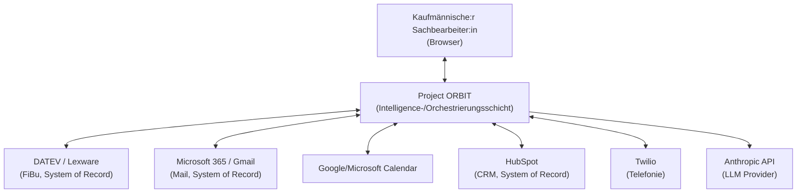
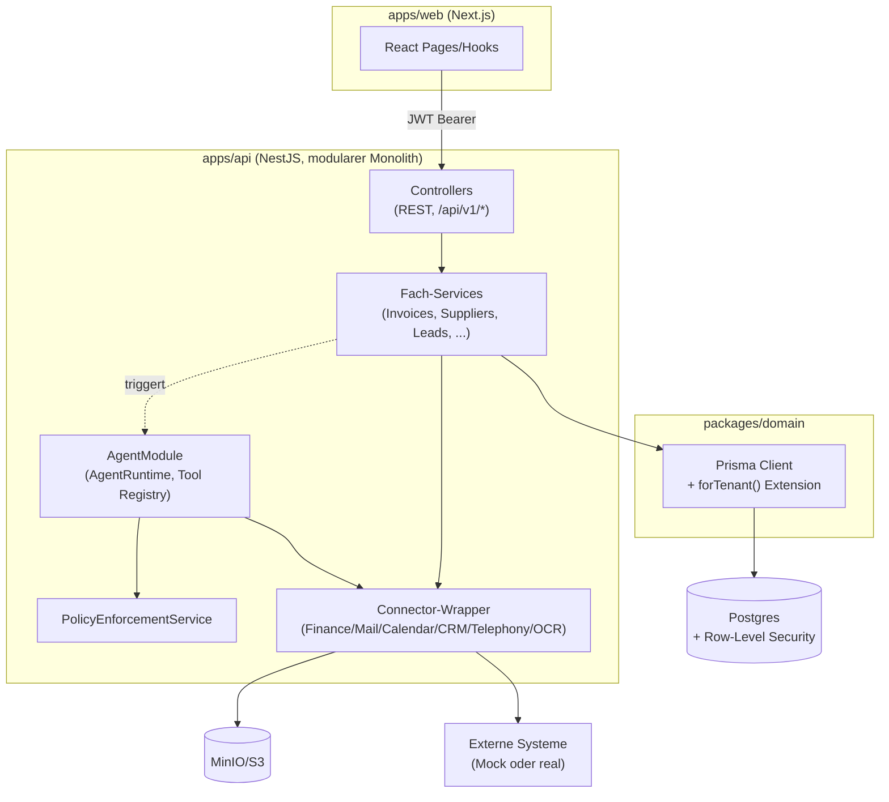
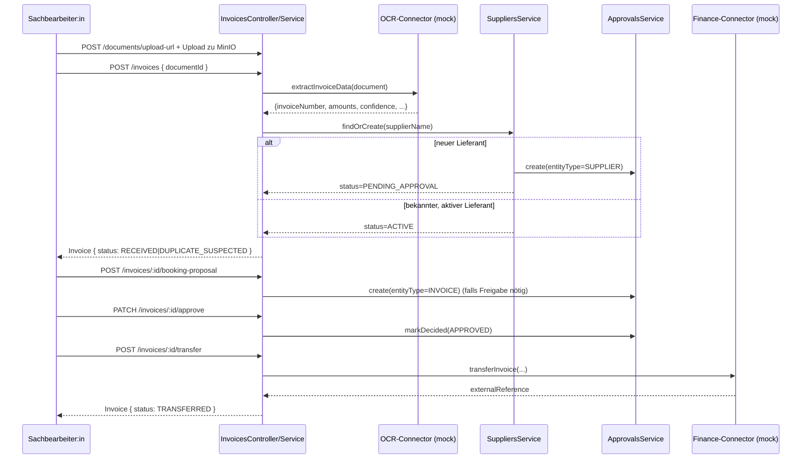
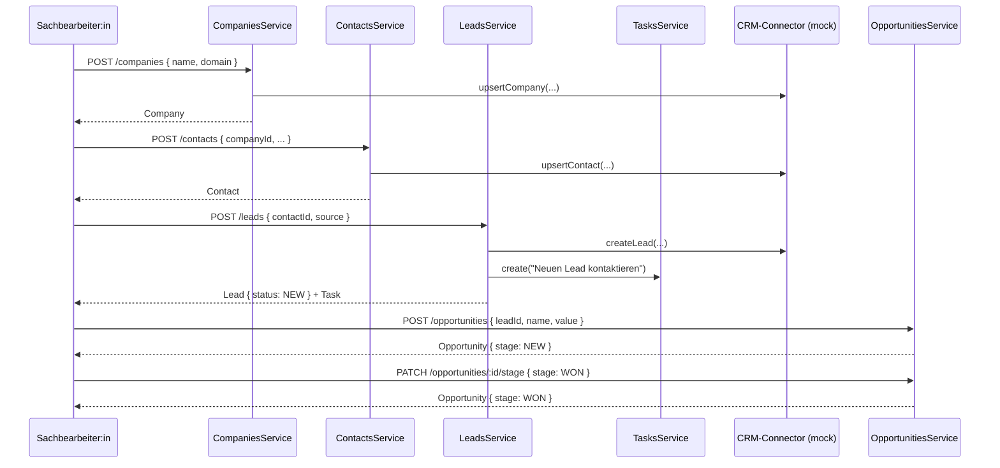

# Architektur — Project ORBIT

Diese Datei beschreibt, wie das System tatsächlich gebaut ist (Stand nach
Phase 15). Für den fachlichen Kontext siehe
[`docs/PRODUCT_CONTEXT.md`](PRODUCT_CONTEXT.md); für Begründungen einzelner
Entscheidungen siehe [`docs/ASSUMPTIONS.md`](ASSUMPTIONS.md) (hier verlinkt,
wo relevant); für den Implementierungsstand je Komponente siehe
[`docs/IMPLEMENTATION_STATUS.md`](IMPLEMENTATION_STATUS.md). Die
Agent-Runtime-internen Details (LLMProvider, Tool Registry, Policy Engine,
AgentRuntime) stehen separat in
[`docs/AGENT_ARCHITECTURE.md`](AGENT_ARCHITECTURE.md).

## Grundprinzip

```
Agent → Tool Registry → Policy Engine → Authorization Check → Tool Gateway → Connector → External System
```

## System Context



ORBIT ersetzt keines dieser Systeme — es liest, klassifiziert, schlägt
vor und schreibt zurück, immer über die jeweilige offizielle Connector-
Schnittstelle (siehe Abschnitt "Connectors" unten). Aktuell sind alle
sechs externen Systeme nur als **Mock-Connector** angebunden (siehe
`docs/INTEGRATIONS.md`) — das Diagramm zeigt die vorgesehene, nicht die
bereits live verdrahtete Anbindung.

Kein direkter LLM-/Agent-Zugriff auf externe Systeme oder die Datenbank.
ORBIT ist eine Intelligence-/Orchestrierungsschicht **über** bestehenden
Systems of Record (DATEV/Lexware, HubSpot, Microsoft 365/Gmail) — es
ersetzt sie nicht.

## Internal Architecture



## Monorepo-Struktur

pnpm-Workspaces + Turborepo, mit einem strikten Abhängigkeitsgraphen:
`apps/*` dürfen von `packages/*` abhängen, niemals umgekehrt (siehe
ASSUMPTIONS #75 für einen konkreten Fall, wo das die Implementierung
beeinflusst hat).

| Paket | Verantwortung |
|---|---|
| `apps/api` | NestJS-Backend (REST-API + BullMQ-Worker-Entry-Point) |
| `apps/web` | Next.js-Frontend (App Router) |
| `packages/domain` | Prisma-Schema, generierter Client, Tenant-Scoping-Extension |
| `packages/shared` | Fehlertypen, RBAC-Permissions/-Rollen, Policy-/Audit-Konstanten — die "single source of truth" für alles, was Backend, Frontend und Agent-Runtime gemeinsam brauchen |
| `packages/agent-core` | LLMProvider-Abstraktion, Tool Registry, Policy-Engine-Entscheidungslogik, AgentRuntime-Orchestrierungsschleife (siehe AGENT_ARCHITECTURE.md) |
| `packages/integration-core` | Connector-Interfaces (Finance/Mail/Calendar/CRM/Telephony/OCR) + Mock-Implementierungen |
| `packages/config` | Branding- und Env-Konfiguration (Zod-validiert), providerunabhängig |
| `packages/ui` | Geteilte React-Komponenten (fünf handgeschriebene Primitives, siehe ASSUMPTIONS #69) |
| `packages/testing` | Test-Fixtures |

Jedes `apps/*`-Paket, das `@orbit/domain` konsumiert, braucht dessen
generierten Prisma-Client — `pnpm --filter @orbit/domain prisma:generate`
läuft deshalb vor jedem Build (siehe Dockerfiles).

## Backend-Module (`apps/api/src`)

Ein modularer Monolith, ein NestJS-Modul pro fachlicher Domäne:
`auth`, `tenants`, `cases`, `tasks`, `documents`, `approvals`, `suppliers`,
`invoices` (Finance), `companies`, `contacts`, `leads`, `opportunities`,
`meetings` (Sales), `policy`, `audit`, `connectors`, `storage`, `prisma`,
`health`, plus `common` (globale Filter) und `config` (Env-Provider).

**Routing-Konvention:** Es gibt keinen globalen `JwtAuthGuard`. Jeder
Controller, der Authentifizierung braucht, wendet
`@UseGuards(JwtAuthGuard, PermissionsGuard)` (+ optional
`@RequirePermissions(...)`) explizit an — nur `AuthController` und
`HealthController` bleiben absichtlich öffentlich. Controller deklarieren
nur ihr Ressourcen-Segment (`{ path: 'invoices' }`); das `v1`-Präfix kommt
ausschließlich aus Nests globaler URI-Versionierung
(`main.ts`, `defaultVersion: '1'`).

## Datenmodell

25 Prisma-Modelle (`packages/domain/prisma/schema.prisma`), grob in sechs
Gruppen:

- **Tenant/Auth**: `Tenant`, `User`, `RefreshToken`, `Role`,
  `RolePermission`, `UserRole`
- **Policy Engine**: `PolicyConfig` (ein Eintrag pro Tenant × Policy-Action)
- **Audit**: `AuditLog` (append-only, bewusst keine FK auf `User` — muss
  unabhängig vom Nutzer-Lifecycle lesbar bleiben)
- **Cases/Tasks/Documents**: `Case` (der fachübergreifende Vorgang, an dem
  Tasks/Dokumente/E-Mails/Invoices/Leads hängen), `Task`, `Document`,
  `EmailMessage`
- **Finance**: `Supplier`, `Invoice`, `BookingProposal`, `FinanceTransfer`,
  `Approval`
- **Sales**: `Company`, `Contact`, `Lead`, `Opportunity`, `Meeting`
- **Integration/Agent**: `Integration` (verschlüsselte Connector-Credentials
  pro Tenant), `AgentRun`, `ToolInvocation` (siehe AGENT_ARCHITECTURE.md)

Jede tenant-gebundene Tabelle trägt `tenant_id` + Index. Geldbeträge sind
`Decimal(14,2)`, nie `Float` (Rundungsfehler in der Finanzbuchhaltung).

## Multi-Tenancy: zwei Verteidigungslinien

1. **Anwendungsschicht** (`packages/domain/src/tenant-scope.ts`):
   `PrismaService.forTenantId(tenantId)` liefert einen Prisma-Client, der
   über eine Client-Extension automatisch jeden Read mit
   `where.tenantId` filtert und jeden Write mit `tenantId` stempelt — ein
   Zugriffsversuch auf einen fremden Tenant wirft
   `TenantIsolationViolationError`, statt still zu scheitern.
2. **Datenbankschicht** (Phase 15, `docs/ASSUMPTIONS.md` #85-90): Postgres
   Row-Level Security auf 21 der 24 tenant-gescopten Tabellen. Die App
   verbindet sich als eigene, nicht-superuser Rolle (`orbit_app`,
   `DATABASE_URL_APP`) — getrennt von der Migrations-Rolle (`orbit`,
   `DATABASE_URL`), die immer Superuser ist und RLS grundsätzlich umgeht.
   `forTenant()` setzt die Tenant-Session-GUC (`app.tenant_id`) pro
   Transaktion (SET-LOCAL-Semantik). Eine Handvoll echter Cross-Tenant-Fälle
   (Login, bevor der Tenant bekannt ist; Tenant-Bootstrap, bevor der Tenant
   existiert) nutzt `PrismaService.withRlsBypass()` explizit.

Beide Linien sind unabhängig wirksam: ein Bug in der einen wird von der
anderen aufgefangen.

## Auth & Autorisierung

- **JWT, zustandslos**: Access-Token trägt Rollen + Permissions direkt im
  Payload (`JwtStrategy.validate()` vertraut dem signierten Payload, kein
  DB-Rückruf pro Request). Refresh-Tokens sind SHA-256-gehashte,
  Single-Use-Werte mit Rotation (`AuthService.refresh()` widerruft den
  alten Token unabhängig vom Erfolg des neuen).
- **RBAC** (`packages/shared/src/permissions.ts`): sechs Rollen
  (`TENANT_ADMIN`, `FINANCE_USER`, `SALES_USER`, `APPROVER`, `VIEWER`,
  `SYSTEM_ADMIN`) × eine feste Liste von Permission-Strings
  (`invoice.approve`, `supplier.manage`, …). `PermissionsGuard` +
  `@RequirePermissions(...)` gaten jede geschützte Route.
- **Policy Engine** ist eine **separate** Achse — sie gated Agent-Autonomie
  (darf ein Agent diese Aktion selbstständig ausführen?), nicht
  Menschen-Berechtigungen (darf dieser Nutzer diese Route aufrufen?). Siehe
  AGENT_ARCHITECTURE.md für Details und wie beide Achsen sich in der Praxis
  überschneiden (`SuppliersService` nutzt die Policy-Engine-Entscheidung
  auch für einen direkten, menschlich getriggerten Service-Call).
- **Passwörter**: argon2. **Rate-Limiting**: global (`RATE_LIMIT_MAX`/
  `_WINDOW_MS`) + ein strengeres, eigenes Limit auf `/auth/login` und
  `/auth/refresh` (`AUTH_RATE_LIMIT_MAX`/`_WINDOW_MS`, siehe ASSUMPTIONS
  #91).

## Storage

Dateien laufen nie durch den API-Prozess: `DocumentsService` erzeugt eine
Presigned-Upload-URL (`StorageService.getUploadUrl`), der Client lädt
direkt zu S3/MinIO hoch, und die `Document`-Zeile bleibt reine Metadaten.
`storageKey` wird serverseitig aus einer UUID + bereinigtem Dateinamen
gebaut (`buildStorageKey()`, path-traversal-sicher).

## Connectors

Jede Drittanbieter-Integration (Finance/Mail/Calendar/CRM/Telephony/OCR)
ist ein Interface in `packages/integration-core`, ausgewählt über Env-Var
(`FINANCE_CONNECTOR=mock|datev|lexware`, …). Nur `mock` ist implementiert;
eine andere Auswahl scheitert beim Boot laut mit
`IntegrationUnavailableError` statt still auf Mock zurückzufallen (siehe
`connectors.module.ts`). Reale Adapter brauchen Provider-Credentials — s.
`docs/INTEGRATIONS.md` / `docs/DATEV_INTEGRATION.md`.

## Request-Lifecycle (Beispiel: `POST /api/v1/invoices/:id/approve`)

1. `helmet()` + CORS (main.ts)
2. `JwtAuthGuard` → `PermissionsGuard` (`INVOICE_APPROVE` erforderlich)
3. `ValidationPipe` (whitelist, forbidNonWhitelisted)
4. `InvoicesController.approve()` → `InvoicesService.approve()`
5. `PrismaService.forTenantId(tenantId)` — RLS-Session-GUC wird gesetzt,
   Query läuft in eigener Transaktion
6. `AuditService.record()` — Audit-Log-Eintrag
7. Bei einem `OrbitError` (z. B. `PolicyViolationError`): globaler
   `OrbitExceptionFilter` mappt auf den deklarierten HTTP-Status + JSON-Body
   (`{code, message, details}`) statt einer nackten 500

## Sequenzdiagramm: Finance-Workflow



## Sequenzdiagramm: Sales-Workflow



## Deployment

Docker Compose orchestriert Postgres, Redis, MinIO, API, Web, Worker
(`docker-compose.yml`) bzw. nur die Infrastruktur für Host-native
`pnpm dev` (`docker-compose.dev.yml`). Beide Dockerfiles nutzen
`turbo prune --docker` (ein self-contained Workspace-Subset +
passende `pnpm-lock.yaml`) statt manuell kuratierter `package.json`-Listen.
Der Postgres-Service baut aus einem eigenen kleinen Image
(`docker/postgres/`), das die RLS-Rollen-Provisionierung beim ersten Start
ausführt (`ENABLE`/`FORCE ROW LEVEL SECURITY` selbst lebt als reguläre
Prisma-Migration).

## Beobachtbarkeit

Strukturiertes Logging über `pino`/`pino-http`. OpenTelemetry ist als
Env-Flag vorgesehen (`OTEL_ENABLED`), aber noch nicht verdrahtet — siehe
`docs/IMPLEMENTATION_STATUS.md`.
