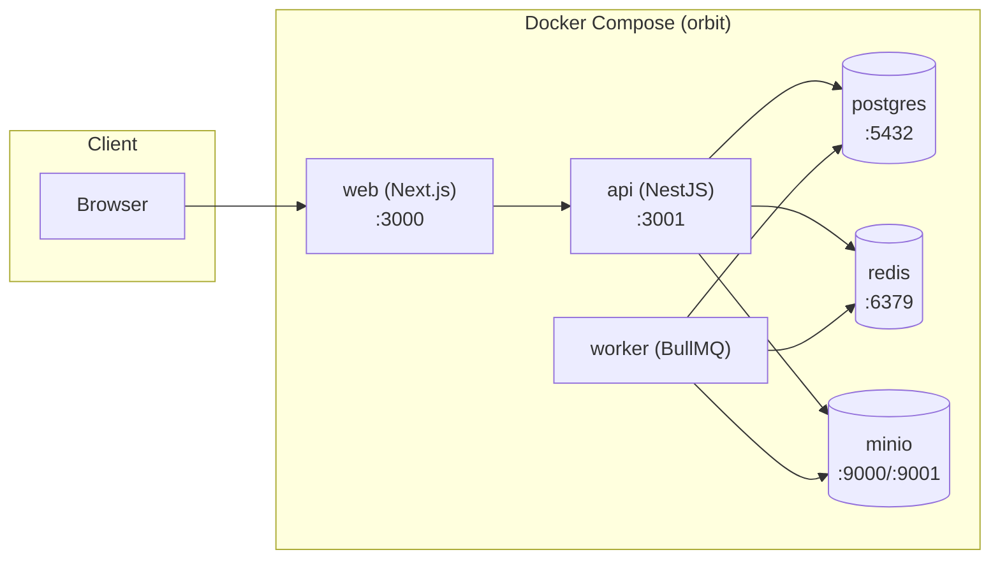

# Deployment — Project ORBIT

Beschreibt, wie das System tatsächlich gebaut, konfiguriert und
gestartet wird — vom lokalen Docker-Compose-Stack bis zu den Punkten,
die für einen echten Produktivbetrieb noch fehlen. Für
Host-native lokale Entwicklung (ohne Docker für die Apps selbst) siehe
[`docs/LOCAL_DEVELOPMENT.md`](LOCAL_DEVELOPMENT.md); für die
Sicherheitsaspekte siehe [`docs/SECURITY.md`](SECURITY.md).

## Architekturüberblick



Fünf Compose-Services (`docker-compose.yml`) plus drei Infrastruktur-
Container. `web` ruft `api` intern über den Compose-Netzwerknamen auf
(`API_BASE_URL=http://api:3001`), der Browser selbst spricht über
`NEXT_PUBLIC_API_BASE_URL` direkt mit `api` (kein Reverse-Proxy im
Compose-Setup selbst — siehe "Was für einen echten Produktivbetrieb
fehlt" unten).

## Images bauen

Beide Produktions-Dockerfiles (`apps/api/Dockerfile`,
`apps/web/Dockerfile`) nutzen **`turbo prune --docker`**
(`pnpm dlx turbo prune @orbit/api --docker`) statt einer manuell
kuratierten `COPY package.json`-Liste: das Kommando berechnet automatisch
genau das Workspace-Subset, das das jeweilige App-Paket transitiv
braucht, plus eine passende, self-contained `pnpm-lock.yaml` — verhindert
den klassischen Fehlermodus, bei dem eine manuelle Datei-Liste nach einer
neuen Abhängigkeit stillschweigend veraltet (`docs/ASSUMPTIONS.md` #41).

Build-Reihenfolge pro Image (mehrstufig, `node:22-alpine`):

1. `pruner`-Stage: `turbo prune` erzeugt das Subset.
2. `deps`-Stage: `pnpm install --frozen-lockfile` gegen das Subset.
3. `build`-Stage: `pnpm --filter @orbit/domain prisma:generate` (der
   generierte Prisma-Client muss vor jedem Build existieren), dann
   `pnpm --filter @orbit/api... build` (die `...`-Notation ist
   zwingend — sie zieht jede transitive Workspace-Abhängigkeit in
   topologischer Reihenfolge mit; ohne sie bauen nur `@orbit/api`s
   eigene Skripte, nicht seine `packages/*`-Abhängigkeiten).
4. `runtime`-Stage: schlankes `node:22-alpine`, kopiert nur das gebaute
   Ergebnis, `CMD ["node", "apps/api/dist/src/main.js"]`.

```bash
docker compose build
docker compose up -d
```

Der `worker`-Service teilt sich dasselbe Image wie `api`
(`apps/api/Dockerfile`), überschreibt nur `command` auf
`node apps/api/dist/worker/main.js`.

## Datenbank-Setup (Reihenfolge zwingend)

Postgis-typische RLS-Rollen-Reihenfolge, identisch lokal und in CI
verifiziert:

1. **Rollen-Provisionierung**: der `postgres`-Service baut aus einem
   eigenen kleinen Image (`docker/postgres/`, nicht das offizielle
   `postgres:16`-Image direkt), das beim ersten Start
   `docker/postgres/10-init-app-role.sh` ausführt — legt die
   eingeschränkte `orbit_app`-Rolle (`NOSUPERUSER NOBYPASSRLS`) an und
   setzt `ALTER DEFAULT PRIVILEGES`, sodass jede **danach** von
   Migrationen angelegte Tabelle automatisch für `orbit_app` freigegeben
   ist. Der eigene Image-Build (statt Bind-Mount) umgeht einen
   Windows-spezifischen Bug, bei dem gemountete Skripte ihr
   Ausführungsbit verlieren (`docs/ASSUMPTIONS.md` #88).
2. **Migrationen**: `pnpm prisma:deploy` (= `prisma migrate deploy`,
   idempotent, für Produktivumgebungen gedacht — im Unterschied zu
   `prisma:migrate` = `prisma migrate dev`, das nur lokal in der
   Entwicklung läuft und interaktiv neue Migrationen erzeugt).
3. **Seed** (nur für Demo-/Eval-Umgebungen, siehe unten):
   `pnpm prisma:seed`.

**Reihenfolge ist wichtig**: `ALTER DEFAULT PRIVILEGES` gilt nur für
Tabellen, die *nach* seiner Ausführung angelegt werden — Rollen-Setup
muss vor den Migrationen laufen, nicht danach. Bei einem
`prisma migrate reset` auf einem wiederverwendeten (nicht neu erstellten)
Postgres-Container geht diese Regel verloren, weil `reset` das
`public`-Schema komplett neu anlegt (`docs/ASSUMPTIONS.md` #93) — der
pragmatische Fix ist, den Postgres-Container statt nur die Datenbank neu
zu erstellen.

## Erforderliche Umgebungsvariablen (Produktivbetrieb)

Vollständige, kommentierte Liste in `.env.example`. Die wichtigsten
Kategorien:

| Kategorie | Variablen | Hinweis |
|---|---|---|
| Datenbank | `DATABASE_URL` (Migrations-Rolle, Superuser), `DATABASE_URL_APP` (App-Laufzeit-Rolle, RLS-gebunden) | **Zwei verschiedene Rollen, zwei verschiedene URLs** — niemals dieselbe Verbindung für beide Zwecke nutzen, sonst ist RLS wirkungslos (siehe `docs/SECURITY.md`) |
| Auth | `JWT_SECRET` (≥16 Zeichen), `JWT_ACCESS_TTL`, `JWT_REFRESH_TTL` | `JWT_SECRET` **muss** in Produktion ein echtes, zufälliges Secret sein — kein Default vorhanden (Zod-Validierung bricht sonst beim Boot ab) |
| Verschlüsselung | `CREDENTIAL_ENCRYPTION_KEY` (Base64, muss zu exakt 32 Bytes dekodieren) | Seit Phase 19g tatsächlich für AES-256-GCM genutzt (`CredentialEncryptionService`, `docs/SECURITY.md` Abschnitt 4) — `apps/api` verweigert den Boot, wenn der Wert nicht zu 32 Bytes dekodiert |
| Datei-Upload-Limits | `MAX_UPLOAD_SIZE_BYTES` (Default 20 MB), `ALLOWED_UPLOAD_MIME_TYPES` (kommagetrennt) | Seit Phase 19g serverseitig durchgesetzt vor Ausstellung einer Presigned-URL (`docs/SECURITY.md` Abschnitt 5) |
| Connectors | `FINANCE_CONNECTOR`, `MAIL_CONNECTOR`, `CALENDAR_CONNECTOR`, `CRM_CONNECTOR`, `TELEPHONY_CONNECTOR`, `OCR_PROVIDER`, `STT_PROVIDER` | Jeweils `mock` oder ein realer Provider-Name; eine nicht-`mock`-Auswahl ohne die zugehörigen Credentials lässt die App beim Boot mit `IntegrationUnavailableError` laut scheitern (kein stiller Mock-Fallback) |
| LLM | `LLM_PROVIDER` (`mock`\|`anthropic`), `ANTHROPIC_API_KEY`, `ANTHROPIC_MODEL` | Siehe `docs/AGENT_ARCHITECTURE.md` |
| CORS/Netzwerk | `CORS_ALLOWED_ORIGINS`, `API_BASE_URL`, `WEB_BASE_URL`, `NEXT_PUBLIC_API_BASE_URL` | Kein Wildcard-Origin in Produktion |
| Branding | `APP_NAME`, `BRAND_NAME`, `BRAND_LOGO`, `PRIMARY_DOMAIN`, `SUPPORT_EMAIL` | Niemals hart im Code — siehe `CLAUDE.md` |
| Rate-Limiting | `RATE_LIMIT_MAX`/`_WINDOW_MS`, `AUTH_RATE_LIMIT_MAX`/`_WINDOW_MS` | Siehe `docs/SECURITY.md` Abschnitt 2 |

## Health Checks

- `GET /api/v1/health` — Liveness (kein DB-/Redis-/S3-Zugriff, siehe
  `docs/KNOWN_LIMITATIONS.md` — prüft aktuell keine echten
  Abhängigkeiten).
- `GET /api/v1/health/ready` — Readiness.
- Jeder Compose-Service hat einen `healthcheck` (Postgres:
  `pg_isready`, Redis: `redis-cli ping`, MinIO: `mc ready local`, API:
  eigener Node-HTTP-Check gegen `/health`) — `depends_on: condition:
  service_healthy` verhindert, dass `api`/`worker` gegen eine noch nicht
  bereite Datenbank starten.

## Skalierung (aktueller Stand)

- **API**: zustandslos (JWT ohne Server-Session), horizontal
  skalierbar — mehrere `api`-Replicas hinter einem Load Balancer sind
  unproblematisch, solange alle dieselbe `DATABASE_URL_APP`/`REDIS_URL`
  nutzen.
  `DATABASE_URL_APP` trägt bereits `connection_limit=20` pro Instanz —
  bei mehreren Replicas gegen Postgres' `max_connections` (Default 100)
  im Blick behalten.
- **Worker**: verarbeitet seit Phase 22 tatsächlich Jobs
  (`WorkflowRunProcessor`, siehe `docs/SCALABILITY_CONCEPT.md`) —
  bisher nur für den asynchronen `POST
  /workflow-definitions/:key/trigger-async`-Pfad, `POST /intake/emails`
  bleibt synchron. Mehrere Worker-Replicas sind technisch möglich (jede
  Instanz zieht Jobs von derselben Redis-Queue), aber es gibt noch
  **keine Pro-Tenant-Concurrency-Begrenzung** — BullMQs Job-Gruppen
  wären dafür die naheliegende Lösung, sind aber eine kostenpflichtige
  BullMQ-Pro-Funktion (`docs/ASSUMPTIONS.md` #176).
- **Web**: zustandslos, horizontal skalierbar wie jede Next.js-App.
- **Postgres/Redis/MinIO**: Einzelinstanzen im Compose-Setup — für
  echten Produktivbetrieb i. d. R. durch verwaltete Dienste
  (RDS/Cloud SQL, ElastiCache/Memorystore, S3) zu ersetzen, siehe
  unten.

## Was für einen echten Produktivbetrieb noch fehlt

Ehrlich benannt statt stillschweigend vorausgesetzt (§63):

- **Kein Reverse Proxy / TLS-Terminierung** im Compose-Setup — `api`
  und `web` exponieren rohes HTTP auf `3001`/`3000`. Eine echte
  Bereitstellung braucht einen vorgeschalteten Proxy (nginx/Traefik/
  Cloud-Load-Balancer) für TLS.
- **Dev-Postgres-Passwörter im Compose-File hart hinterlegt**
  (`orbit_local_dev`, `orbit_app_local_dev`) — für `docker-compose.yml`
  akzeptabel, da klar als lokaler/Demo-Stack markiert, aber **nicht**
  für einen echten Produktiv-Einsatz geeignet; dort gehören alle Secrets
  in einen echten Secret-Store (nicht in eine `.env`-Datei im Repo oder
  hartkodiert in `docker-compose.yml`).
- **Keine automatisierte Migrations-Ausführung beim Container-Start** —
  `pnpm prisma:deploy` muss explizit als eigener Schritt vor dem ersten
  Start von `api` laufen (siehe CI-Pipeline als Referenzimplementierung,
  `.github/workflows/ci.yml`).
- **Kein Kubernetes-/Multi-Region-Deployment** — explizites Nicht-Ziel
  des MVP (§60 des Master-Prompts, siehe
  `docs/KNOWN_LIMITATIONS.md`).
- **Kein Dependency-Vulnerability-Scanning** (`pnpm audit` o. Ä.) in der
  CI-Pipeline.
- **CI-Pipeline-Erweiterungen (MinIO-Service, RLS-Rollen-Setup,
  Playwright-Install) sind nicht gegen einen echten
  GitHub-Actions-Runner verifiziert** — nur gegen die lokal
  identischen Docker-Äquivalente (`docs/ASSUMPTIONS.md` #83, #89).
- **Kein automatisiertes Backup/Restore-Verfahren** für Postgres/MinIO
  dokumentiert oder gebaut.
- **`OTEL_ENABLED`** ist als Env-Flag vorgesehen, aber nicht verdrahtet
  — kein verteiltes Tracing in Produktion verfügbar.

## Demo-/Eval-Umgebung vs. echter Produktivbetrieb

`pnpm prisma:seed` legt einen vollständigen Demo-Mandanten
("Musterwerk GmbH", `docs/DEMO_DATA.md`) an — **destruktiv-idempotent**:
löscht bei jedem Lauf zuerst einen vorhandenen `musterwerk`-Mandanten
kaskadierend und legt ihn neu an. Für eine Demo-/Eval-Installation ist
das der gewünschte, reproduzierbare Zustand. **Für einen echten
Produktivbetrieb darf `prisma:seed` nie ausgeführt werden** — es gibt
keinen "nur wenn leer"-Schutz, ein versehentlicher Lauf gegen eine echte
Kundendatenbank mit demselben Slug würde deren Daten löschen (kollidiert
aber nur bei identischem Tenant-`slug` "musterwerk", ist also in der
Praxis unwahrscheinlich, aber nicht durch einen expliziten Code-Schutz
verhindert).
