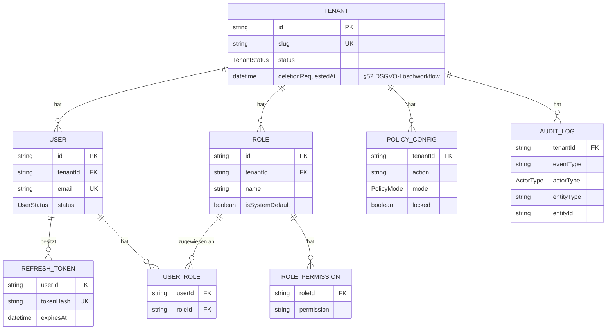
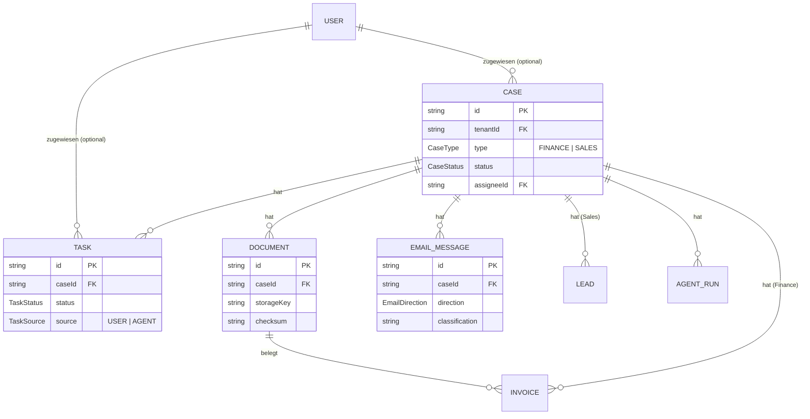
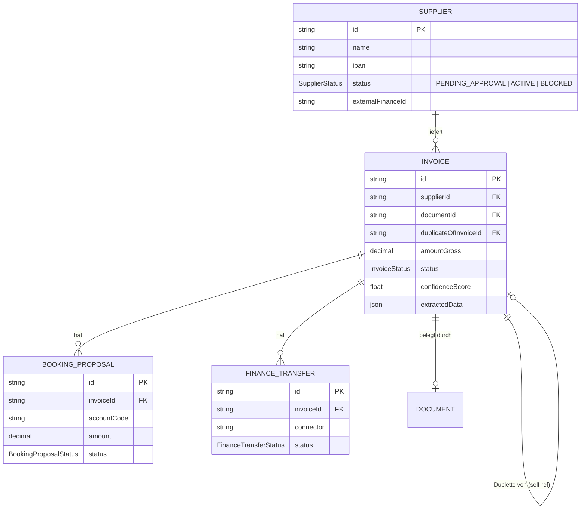
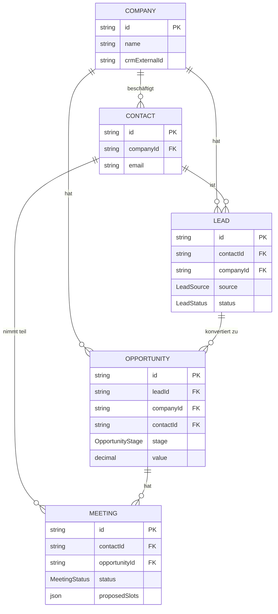
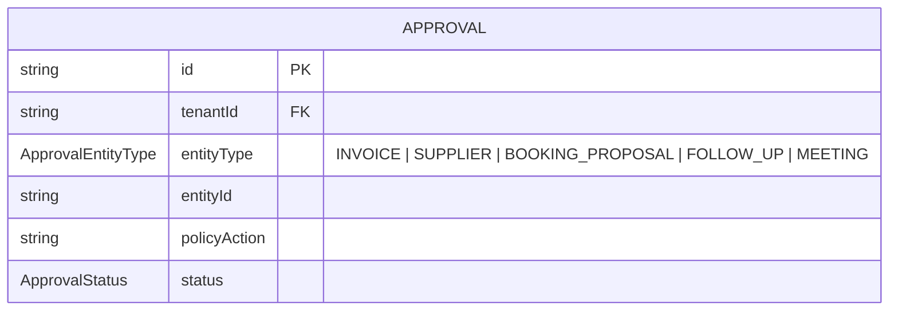
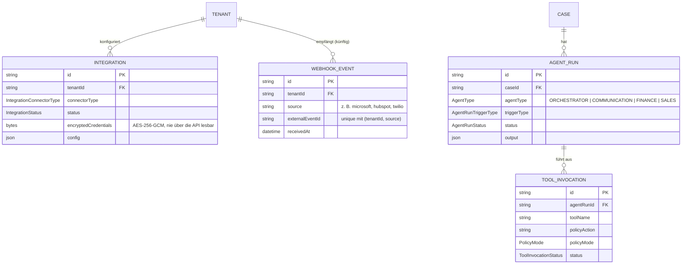

# Domain Model — Project ORBIT

Diese Datei beschreibt die 25 Prisma-Modelle
(`packages/domain/prisma/schema.prisma`), ihre Beziehungen und die
fachliche Idee dahinter — als Ergänzung zum reinen Schema-Code, nicht als
Ersatz dafür. Für die exakten Feldtypen/Constraints ist das Schema selbst
immer die Quelle der Wahrheit; diese Datei erklärt das *Warum* der
Struktur. Für die Sicherheitsmechanismen rund um Multi-Tenancy siehe
[`docs/SECURITY.md`](SECURITY.md); für den Implementierungsstand siehe
[`docs/IMPLEMENTATION_STATUS.md`](IMPLEMENTATION_STATUS.md).

## Grundprinzipien

- **Jede tenant-gebundene Tabelle trägt `tenant_id`** (+ Index, meist
  zusätzlich in einem zusammengesetzten Index mit dem häufigsten
  Filterfeld, z. B. `[tenantId, status]`). Keine Ausnahme außer den drei
  in `docs/SECURITY.md` Abschnitt 1 genannten Tabellen ohne eigene
  Spalte (`role_permissions`, `user_roles`, `refresh_tokens`), die ihren
  Tenant nur indirekt über die Elterntabelle erreichen.
- **Geldbeträge sind immer `Decimal(14,2)`, nie `Float`** — verhindert
  Rundungsfehler in der Finanzbuchhaltung (`amountNet`, `amountGross`,
  `vatAmount`, `BookingProposal.amount`, `Opportunity.value`).
- **`Case` ist der fachübergreifende Anker**: jeder eingehende
  Finance- oder Sales-Vorgang bekommt einen `Case`, an dem sich
  `Task`, `Document`, `EmailMessage`, `Invoice`, `Lead` und `AgentRun`
  optional aufhängen (alle mit `caseId String?` — ein `Case` ist ein
  *Kontext*, keine Voraussetzung; die direkten Fach-Workflows,
  z. B. `POST /invoices` ohne Case, funktionieren unabhängig davon,
  siehe `docs/ASSUMPTIONS.md` #96).
- **`AuditLog` hat bewusst keine Foreign Key auf `User`** — muss
  unabhängig vom Nutzer-Lifecycle lesbar bleiben.

## 1. Tenant, Auth, RBAC

`Role`/`RolePermission`/`UserRole` sind bewusst **tenant-scoped**, nicht
global — jeder Tenant bekommt beim Bootstrap eigene Rollen-Zeilen, aus
`DEFAULT_ROLE_PERMISSIONS` (`@orbit/shared`) geseedet, aber danach pro
Tenant unabhängig anpassbar (§9 des Master-Prompts, "White-Label-fähige
RBAC"). `PolicyConfig` ist die separate Achse für Agent-Autonomie (siehe
`docs/AGENT_ARCHITECTURE.md`) — **nicht** dasselbe wie RBAC, auch wenn
beide "wer darf was" beantworten.

## 2. Cases, Tasks, Dokumente, Kommunikation

`Document` trägt nur Metadaten — die Datei selbst liegt in S3/MinIO,
referenziert über `storageKey` (path-traversal-sicher aus UUID +
bereinigtem Dateinamen gebaut). `checksum` (SHA-256) wird nur für
Uploads über den serverseitigen `putObjectBytes()`-Pfad berechnet
(Agent-Intake, Phase 18) — Dokumente über den älteren
Presigned-URL-Client-Upload-Pfad haben aktuell kein `checksum`.

## 3. Finance

**Statusfluss `Invoice`**: `RECEIVED → EXTRACTED → (DUPLICATE_SUSPECTED |
PENDING_APPROVAL) → APPROVED → TRANSFERRED` (oder `REJECTED` /
`TRANSFER_FAILED` als Abzweigungen). Die `duplicateOfInvoiceId`-Selbst-
Referenz trägt die Dublettenprüfung — eine als Dublette erkannte Rechnung
zeigt per FK auf das vermutete Original, statt eines separaten
Vergleichs-Datensatzes.

**`Supplier.status` startet immer bei `PENDING_APPROVAL`** (Policy-Action
`supplier.create`, hart mindestens `REQUIRE_APPROVAL` — ein Lieferant,
den der Tenant nie freigegeben hat, darf nie Zahlungen erhalten, §17 des
Master-Prompts).

## 4. Sales / CRM

Eine `Lead.contactId` ist **Pflicht** (`Contact` muss existieren, bevor
ein Lead angelegt werden kann — `LeadsService.create()` wirft
`NotFoundError`, wenn nicht), `companyId` ist optional (ein Lead kann von
einem Einzelkontakt ohne bekannte Firma stammen). Jede Lead-Erzeugung
erzeugt automatisch eine Folge-`Task` (§7 des Master-Prompts).

## 5. Approvals (generische Freigabe-Warteschlange)

`Approval` hat **keine** eigene Foreign Key auf die jeweilige Entität —
`entityType` + `entityId` sind ein polymorpher Verweis (wie
`AuditLog.entityType`/`entityId`). Entscheidungen (`approve`/`reject`)
passieren immer auf dem Endpunkt der besitzenden Entität
(`PATCH /suppliers/:id/approve`, `PATCH /invoices/:id/approve`), die
intern `ApprovalsService.markDecided()` aufruft — es gibt bewusst keinen
generischen "decide"-Endpunkt hier (siehe Kommentar in
`ApprovalsService`). **Aktuell erzeugen nur `SUPPLIER` und `INVOICE`
tatsächlich Approval-Zeilen** aus echten Service-Aufrufen; `FOLLOW_UP`
kommt vom Agent Runtime (blockierte Tool-Aufrufe, siehe
`docs/AGENT_ARCHITECTURE.md`); `BOOKING_PROPOSAL` und `MEETING` sind im
`ApprovalEntityType`-Enum vorgesehen, aber im Code (noch) nirgends
tatsächlich erzeugt.

## 6. Integrationen, Agent Runtime und Webhooks

`AgentType.ORCHESTRATOR` existiert im Enum, wird aber aktuell nie als
eigener `AgentRun` erzeugt — das Routing zwischen Finance-/Sales-Agent
ist deterministischer Code (`IntakeService`), kein eigener LLM-Lauf
(`docs/ASSUMPTIONS.md` #99). `Integration.encryptedCredentials` wird
seit Phase 19g tatsächlich beschrieben (`IntegrationsModule` +
`CredentialEncryptionService`) — siehe `docs/SECURITY.md` Abschnitt 4.
`WebhookEvent` ist reine Idempotenz-Infrastruktur für einen künftigen
echten Webhook-Empfänger (noch keiner vorhanden, jeder Connector bleibt
ein Mock) — der eindeutige Index auf `(tenantId, source,
externalEventId)` macht Duplikaterkennung atomar auf DB-Ebene.

## Enum-Übersicht

Für alle in den Diagrammen referenzierten Enums (`TenantStatus`,
`UserStatus`, `CaseType`/`CaseStatus`, `TaskStatus`/`TaskSource`,
`InvoiceStatus`, `SupplierStatus`, `BookingProposalStatus`,
`FinanceTransferStatus`, `ApprovalEntityType`/`ApprovalStatus`,
`LeadSource`/`LeadStatus`, `OpportunityStage`, `MeetingStatus`,
`IntegrationConnectorType`/`IntegrationStatus`, `AgentType`,
`AgentRunTriggerType`/`AgentRunStatus`, `ToolInvocationStatus`,
`PolicyMode`, `ActorType`) ist `packages/domain/prisma/schema.prisma`
selbst die vollständige, aktuelle Quelle — sie hier zu duplizieren würde
bei jeder Schema-Änderung sofort veralten. Businessfreundliche
deutsche Labels für die UI-Anzeige jedes Enum-Werts stehen in
`apps/web/src/lib/status-labels.ts`.
