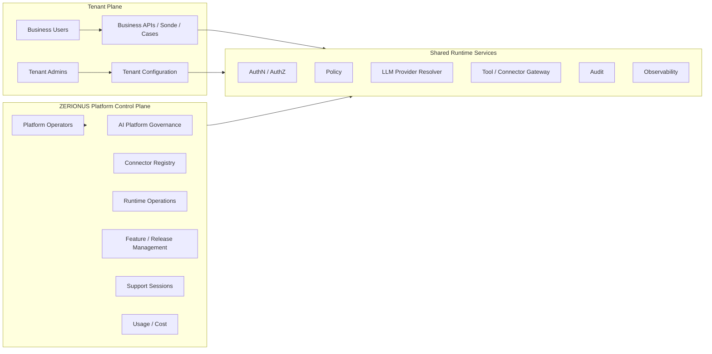

# ORBIT MASTER SPECIFICATION v3 — AMENDMENT 03
## ZERIONUS Platform Operations, Administration & Diagnostics

**Projekt:** ZERIONUS / ORBIT  
**Dokumenttyp:** Verbindliche Entwicklungs- und Abnahmespezifikation für Claude Code  
**Version:** 1.0  
**Datum:** 06.10.2026  
**Status:** Entwicklungsfreigabe; beschreibt den Sollzustand, keine Bestätigung bereits implementierter Funktionen  
**Basis:** `ORBIT_MASTER_SPECIFICATION_v3.md`  
**Integrationsbasis:** `ORBIT_MASTER_SPECIFICATION_v3_AMENDMENT_01_INTEGRATION_FRAMEWORK_v2.md`  
**Orchestrierungsbasis:** `ORBIT_MASTER_SPECIFICATION_v3_AMENDMENT_02_BUSINESS_PROCESS_ORCHESTRATION_FRAMEWORK_v1.2.md`  
**UI-Basis Tenant:** `ORBIT_UI_UX_DEVELOPMENT_SPECIFICATION_v2.md`  
**Visibility Addendum:** `ORBIT_UI_UX_DEVELOPMENT_SPECIFICATION_v2_ADDENDUM_01_PRODUCTION_DIAGNOSTICS_BOUNDARY_v1.md`

---

# 0. Gültigkeit und Ziel

Dieses Amendment führt eine explizite **ZERIONUS Platform Control Plane** ein.

Die Platform Control Plane ist die Betreiber- und Herstelleradministration von ORBIT. Sie ist nicht dasselbe wie die Administration eines Kunden-Tenants.

Die Spezifikation regelt:

- Platform-Rollen und Security Domain,
- globale Plattformkonfiguration,
- Tenant Operations,
- AI Provider Registry und Model Governance,
- ORBIT Managed AI und Customer Managed AI/BYOK,
- Provider Routing, Fallback, Health und Kosten,
- Connector Registry und globale Connector-Steuerung,
- Feature Flags und kontrollierte Rollouts,
- Runtime Operations und technische Diagnostik,
- Support Sessions und kontrollierten Tenant-Zugriff,
- Audit, Secrets, Observability und Security,
- Konfigurationshierarchie und Overrides,
- Migration aus bestehender Administration,
- APIs und serverseitige Autorisierung,
- Tests, Akzeptanz und Nachweise.

## 0.1 Verbindliche Produktentscheidung

ORBIT besitzt drei klar getrennte Bedien- und Berechtigungsebenen:

```text
1. BUSINESS USER
   fachliche tägliche Arbeit

2. TENANT ADMIN
   Konfiguration des eigenen Unternehmens/Tenants

3. ZERIONUS PLATFORM OPERATIONS
   Hersteller- und Betreibersteuerung der ORBIT-Plattform
```

Die dritte Ebene ist notwendig, weil bestimmte Entscheidungen **nicht kundenspezifisch**, sondern plattformweit sind.

Beispiele:

```text
welche AI Provider ORBIT unterstützt
welche Modelle freigegeben sind
welches Model Profile standardmäßig welchen Provider nutzt
welche Connector-Version produktiv ist
welche Feature Flags global oder für Pilot-Tenants aktiv sind
welche Plattformgrenzen niemals vom Tenant überschrieben werden dürfen
wie Provider-/Connector-Health bewertet wird
wie Support Zugriff erhält
```

## 0.2 Kein customer-visible Developer Mode

Die Platform Control Plane darf **nicht** als „Developer Mode“ innerhalb der normalen Tenant-Administration realisiert werden.

Ein versteckter Frontend-Link oder ein UI-Schalter reicht nicht.

Es benötigt:

```text
separate role domain
server-side authorization
separate route/API scope
audit
tenant isolation
support-access controls
```

## 0.3 Kein aktuelles Tenant-UI-Redesign

Dieses Amendment fordert keine visuelle Neugestaltung der Kunden-UI.

Die `ORBIT_UI_UX_DEVELOPMENT_SPECIFICATION_v2.md` bleibt für den Tenant-Bereich visuell verbindlich. Änderungen an der Kundenoberfläche werden separat screenshotbasiert spezifiziert.

Dieses Amendment darf jedoch neue Platform-Operations-Routen/UI definieren.

# 0.4 Konsistenzregel — bestehende Plattformdienste erweitern, nicht duplizieren

Dieses Amendment führt **keine zweite Auth-, RBAC-, Connector-, AI-Provider-, Audit-, Workflow-, Policy- oder Secret-Plattform** ein.

Alle in diesem Dokument genannten Interfaces und Entities sind **logische Zielverträge**. Claude Code muss vor einer neuen Tabelle, Registry oder Serviceklasse prüfen, ob die bestehende Master-/Amendment-Architektur dieselbe Verantwortung bereits besitzt.

Verbindliche Abbildung:

| Dieses Amendment | Bestehender Eigentümer | Regel |
|---|---|---|
| Platform Roles/Scopes | bestehende Auth-/Role-/Permission-Infrastruktur | um Security Domain/Scopes erweitern; kein paralleles Login-/RBAC-System |
| `AIProviderConnection` / Platform Provider Connection | bestehendes `AIProviderConnection`-Modell | `PLATFORM_MANAGED` und `TENANT_MANAGED` sauber nutzen/erweitern |
| `AIModelProfile` | bestehendes `AIModelProfile` | versionieren/erweitern; keine zweite Profile-Tabelle mit gleichem Zweck |
| Provider/Model Catalogue | bestehendes `AIProviderModule` / Provider Registry | Governance-Metadaten ergänzen |
| Platform Connector Definition | **dieselbe Connector Registry aus Amendment 01 v2** | Lifecycle/Governance-Felder ergänzen; keine zweite Connector Registry |
| Platform Audit | bestehendes `AuditModule` / `AuditEvent` | Platform Eventtypen/Scopes ergänzen; kein konkurrierender Audit Store |
| Platform Secrets | bestehende Credential-/Secret-Store-Abstraktion | wiederverwenden |
| Diagnostics | bestehende Observability + autorisierte Projektion | kein zweiter Workflow-/Case-Datenspeicher |
| Support Session | bestehende AuthZ/Audit-Infrastruktur | neuer kontrollierter Scope/Lifecycle, kein dauerhafter Impersonation-Account |

Falls eine bestehende Struktur fachlich ungeeignet ist, muss Claude vor einer Parallelstruktur eine ADR mit Begründung, Migration und Ownership erstellen.

---

# 1. Architektur: Tenant Plane und Platform Control Plane



Die Control Plane darf dieselben technischen Basiskomponenten und dasselbe Repository verwenden. Eine separate physische Anwendung ist für den MVP nicht zwingend.

Die logische Security-Grenze ist jedoch zwingend.

# 2. Rollenmodell

## 2.1 Tenant-Rollen

Bestehende Tenant-Rollen bleiben erhalten, beispielsweise:

```text
BUSINESS_USER
TENANT_ADMIN
OPERATOR
REVIEWER
APPROVER
AUDITOR
SERVICE_PRINCIPAL
```

Sie gelten **nur innerhalb ihres Tenants**.

## 2.2 Platform-Rollen

Mindestens:

```text
PLATFORM_OWNER
PLATFORM_OPERATOR
PLATFORM_SUPPORT
PLATFORM_SECURITY
PLATFORM_FINOPS
PLATFORM_RELEASE_MANAGER
PLATFORM_ENGINEERING
PLATFORM_AUDITOR
```

Eine Person kann mehrere Platform-Rollen besitzen. Rechte werden capability-/scopebasiert serverseitig geprüft.

## 2.3 Rollenmatrix

| Fähigkeit | Owner | Operator | Support | Security | FinOps | Release | Engineering | Auditor |
|---|---:|---:|---:|---:|---:|---:|---:|---:|
| Platform Config lesen | ✓ | ✓ | begrenzt | ✓ | begrenzt | ✓ | ✓ | ✓ |
| Platform Config ändern | ✓ | begrenzt | – | Security-Bereich | – | Release-Bereich | begrenzt | – |
| AI Provider Registry | ✓ | ✓ | read | Security review | cost read | rollout read | ✓ | audit |
| Platform Secrets setzen | ✓/delegiert | begrenzt | – | policy | – | – | begrenzt | – |
| Tenant-Liste sehen | ✓ | ✓ | ✓ | ✓ | ✓ | ✓ | ✓ | audit |
| Tenant-Businessdaten sehen | nur via Support Scope | nur via Support Scope | nur via Support Scope | nur begründet | – | – | nur begründet | nur nach Policy |
| Feature Flags verwalten | ✓ | begrenzt | – | kill switch | – | ✓ | staging/pilot | audit |
| Provider Cost sehen | ✓ | begrenzt | – | – | ✓ | – | begrenzt | audit |
| Security Events | ✓ | begrenzt | begrenzt | ✓ | – | – | begrenzt | ✓ |
| Audit unveränderlich lesen | ✓ | begrenzt | eigene Sessions | ✓ | cost relevant | release relevant | engineering relevant | ✓ |

Die konkrete Matrix darf im Repository an vorhandene Permission-Mechanismen angepasst werden. Die Trennung der Verantwortungen darf dadurch nicht abgeschwächt werden.

## 2.4 Strikte Security Domain

Tenant-Rollen können keine Platform-Rollen vergeben.

Verbindlich:

```text
Tenant role management endpoint
cannot create
cannot grant
cannot modify
PLATFORM_*
```

Platform-Rollen werden nur aus einer Platform-Identity-Administration vergeben.

# 3. Authentication und Platform Session

## 3.1 Platform Session

Nach erfolgreicher Authentifizierung wird ein Platform-Kontext serverseitig aufgebaut:

```typescript
interface PlatformPrincipal {
  userId: string;
  platformRoles: string[];
  platformScopes: string[];
  authenticationAssurance: string;
  sessionId: string;
  issuedAt: string;
  expiresAt: string;
}
```

## 3.2 MFA / Step-up

Für hochkritische Operationen muss die Architektur Step-up Authentication ermöglichen, insbesondere:

```text
Platform Secret ändern
Provider Connection ändern
globalen Kill Switch ändern
globale Feature-Freigabe
Support Session mit tiefem Datenzugriff
Security Policy ändern
```

Falls das aktuelle Auth-System Step-up noch nicht unterstützt, dokumentiert Claude die Lücke und implementiert mindestens eine klare Extension Boundary; Sicherheitskritische Operationen dürfen nicht fälschlich als vollständig abgesichert behauptet werden.

## 3.3 CSRF / Session Protection

State-changing Platform-Endpunkte benötigen dieselben oder strengere Schutzmechanismen wie Tenant-Endpunkte:

- serverseitige Berechtigungsprüfung,
- CSRF-Schutz, soweit Cookie Sessions,
- sichere SameSite/HttpOnly/Secure Cookies,
- kurze Session Lifetime,
- Session Revocation,
- Audit.

# 4. Platform Control Plane — Funktionsbereiche

Die Control Plane umfasst mindestens:

```text
Overview
Tenants
AI Platform
Connectors
Runtime & Jobs
Diagnostics
Features & Releases
Usage & Cost
Security
Support
Audit
Platform Settings
```

Dies sind Platform-Funktionsbereiche, **keine neuen Tenant-Navigationsmodule**.

# 5. Platform Overview

Die Startseite zeigt ausschließlich aggregierte Betriebsinformation:

```text
platform health
active tenants
critical incidents
provider health
connector health
failed/blocked runs
queue/worker health
usage trend
estimated AI cost
recent releases
active support sessions
security alerts
```

Keine unkontrollierte Anzeige personenbezogener Kundeninhalte.

Aggregation muss tenant- und rollenbewusst erfolgen.

# 6. Tenant Operations

## 6.1 Tenant Registry

Platform Operations darf Tenant-Metadaten verwalten:

```typescript
interface PlatformTenantRecord {
  tenantId: string;
  displayName: string;
  lifecycleStatus:
    | 'PROVISIONING'
    | 'ACTIVE'
    | 'SUSPENDED'
    | 'OFFBOARDING'
    | 'CLOSED';
  planKey?: string;
  regionPolicyRef?: string;
  createdAt: string;
  updatedAt: string;
  featureCohortRefs: string[];
  supportPolicyRef?: string;
}
```

Keine Business-Stammdaten in dieser Registry duplizieren.

## 6.2 Tenant Lifecycle

Mindestens:

```text
provision
activate
suspend new processing
resume
offboard
close
```

`SUSPENDED` muss klar unterscheiden zwischen:

```text
login suspended
new automation suspended
all connector activity suspended
billing suspension
security quarantine
```

Ein pauschaler Boolean reicht langfristig nicht.

## 6.3 Tenant Overrides

Plattformweite Defaults dürfen pro Tenant überschrieben werden, **nur wenn die jeweilige Einstellung als overridefähig definiert ist**.

Beispiel:

```text
default model profile mapping         → overrideable
platform security requirement         → not overrideable
connector beta availability           → overrideable
maximum autonomous payment            → not applicable / prohibited
regional provider restriction         → only stricter tenant override
```

# 7. Configuration Precedence

Verbindliche Hierarchie:

```text
Immutable Platform Security
>
Platform Product Policy
>
Platform Environment Configuration
>
Tenant Policy / Tenant Override
>
Blueprint / Agent Configuration
>
User Preference / Request
>
LLM Proposal
```

Bei Konflikt gewinnt die höhere Ebene.

Claude Code muss verhindern, dass:

- Tenant Config immutable Platform Security überschreibt,
- Blueprint eine Tenant Policy lockert,
- Agent Prompt eine Platform Policy überschreibt,
- LLM-Ausgabe Berechtigungen verändert.

# 8. AI Platform Governance

## 8.1 Grundsatz

Geschäftscode referenziert **Model Profiles**, nicht konkrete Provider/Modelnamen.

Beispiel:

```text
FAST_CLASSIFICATION
DOCUMENT_EXTRACTION
COMPLEX_REASONING
BUSINESS_DRAFTING
COPILOT_INTERACTIVE
AGENT_TOOL_USE
```

Resolver:

```text
Model Profile
→ Routing Policy
→ Approved Provider
→ Approved Model
→ Credential Connection
→ Runtime Parameters
```

## 8.2 Provider Registry

```typescript
interface AIProviderDefinition {
  providerKey: string;
  displayName: string;
  adapterKey: string;
  lifecycle:
    | 'DRAFT'
    | 'VALIDATING'
    | 'ACTIVE'
    | 'DEPRECATED'
    | 'SUSPENDED'
    | 'RETIRED';
  supportedCredentialTypes: string[];
  supportedRegions: string[];
  supportedCapabilities: string[];
  dataHandlingPolicyRefs: string[];
  healthCheckConfigRef: string;
  createdAt: string;
  updatedAt: string;
}
```

Ein Provider ist nicht automatisch produktiv, nur weil ein SDK installiert ist.

## 8.3 Model Registry

```typescript
interface AIModelDefinition {
  id: string;
  providerKey: string;
  providerModelId: string;
  displayName: string;
  lifecycle:
    | 'VALIDATING'
    | 'APPROVED'
    | 'DEPRECATED'
    | 'BLOCKED'
    | 'RETIRED';
  capabilityTags: string[];
  contextLimit?: number;
  toolUseSupported?: boolean;
  structuredOutputSupported?: boolean;
  regionAvailability: string[];
  dataPolicyRefs: string[];
  costProfileRef?: string;
  evaluationSuiteRef?: string;
  approvedAt?: string;
  deprecatedAt?: string;
}
```

## 8.4 Model Profile

```typescript
interface AIModelProfile {
  profileKey: string;
  version: number;
  purpose: string;
  requiredCapabilities: string[];
  defaultRouteRef: string;
  fallbackPolicyRef: string;
  maxLatencyMs?: number;
  maxCostClass?: string;
  requiredDataPolicyRefs: string[];
  lifecycle: 'DRAFT' | 'TESTING' | 'PUBLISHED' | 'DEPRECATED';
}
```

Published Profile-Versionen sind unveränderlich. Änderungen erzeugen neue Versionen.

## 8.5 Provider / Model Wechsel

Ein Herstellerwechsel darf Business-Prozesse nicht ändern.

Beispiel:

```text
vorher:
COMPLEX_REASONING → Provider A / Model X

nachher:
COMPLEX_REASONING → Provider B / Model Y
```

Der Case-/Blueprint-Code bleibt unverändert.

Voraussetzungen für Route-Aktivierung:

```text
adapter active
model approved
evaluation passed
region/data policy compatible
credential connection healthy
rollout permitted
```

# 9. ORBIT Managed AI

## 9.1 Default

Für Standardkunden ist `ORBIT_MANAGED` der Default.

Der Tenant benötigt keinen eigenen Provider-API-Key.

Platform Operations kontrolliert:

```text
provider connections
model routes
health
usage
cost
fallback
deprecation
regional availability
```

## 9.2 Platform Provider Connection

```typescript
interface PlatformAIProviderConnection {
  id: string;
  providerKey: string;
  regionKey?: string;
  credentialType: string;
  secretReference: string;
  lifecycle:
    | 'CONFIGURING'
    | 'ACTIVE'
    | 'DEGRADED'
    | 'SUSPENDED'
    | 'REVOKED';
  lastValidatedAt?: string;
  lastHealthResultRef?: string;
  allowedProfileKeys: string[];
  createdBy: string;
  updatedBy: string;
}
```

Secrets werden nie nach Save vollständig zurückgegeben.

# 10. Customer Managed AI / BYOK

## 10.1 Grundsatz

BYOK bedeutet:

```text
Tenant supplies credential
```

nicht:

```text
Tenant may connect arbitrary AI endpoint/model
```

Tenant-Auswahl ist begrenzt auf:

```text
approved provider adapter
approved credential type
approved model/profile
allowed region/data policy
```

## 10.2 BYOK Resolution

Routing:

```text
Tenant Mode = BYOK
→ resolve tenant-approved provider connection
→ validate profile compatibility
→ apply tenant no-fallback/default fallback policy
→ execute
```

## 10.3 Kein stilles Cross-Provider Fallback

Bei BYOK ist Standard:

```text
NO_FALLBACK
```

Ein Wechsel zu einer anderen Anbieterplattform darf nur erfolgen, wenn:

- vom Tenant ausdrücklich zugelassen,
- vom Platform Policy zulässig,
- datenschutz-/regionskonform,
- auditiert.

# 11. AI Routing Policy

```typescript
interface AIProviderRoute {
  id: string;
  modelProfileKey: string;
  environment: string;
  tenantScope?: string;
  primaryModelRef: string;
  fallbackModelRefs: string[];
  fallbackMode:
    | 'NO_FALLBACK'
    | 'SAME_PROVIDER_FALLBACK'
    | 'APPROVED_CROSS_PROVIDER_FALLBACK';
  trafficPercent?: number;
  cohortRef?: string;
  activeFrom?: string;
  activeUntil?: string;
  policyVersion: string;
}
```

## 11.1 Routing Evaluation

Resolver berücksichtigt mindestens:

```text
tenant AI mode
tenant data region
platform security policy
provider health
model health
model profile requirements
tenant override
feature rollout
rate limits
cost guardrails
fallback policy
```

## 11.2 Kein Provider im Businesscode

Verboten:

```typescript
if (intent === "SALES") openai.chat(...)
```

Erforderlich:

```typescript
aiProviderResolver.execute({
  modelProfile: "BUSINESS_DRAFTING",
  tenantContext,
  taskContext
})
```

# 12. AI Health, Usage und FinOps

## 12.1 Health

Mindestens:

```text
UP
DEGRADED
RATE_LIMITED
DOWN
DISABLED
UNKNOWN
```

Health-Signale:

- aktive Health Checks,
- reale Fehlerrate,
- Latenz,
- Rate-Limit-Ereignisse,
- Auth-Fehler,
- strukturierte Output Failure Rate,
- Circuit Breaker.

## 12.2 Usage

Track mindestens:

```text
tenant
provider
model profile
model id
agent/workflow/case reference where allowed
input units/tokens
output units/tokens
request count
latency
estimated cost
execution mode
timestamp
```

Kosteninformationen sind Platform FinOps. Ein Tenant kann später verbrauchsbezogene Daten sehen, wenn Produkt-/Commercial-Policy dies vorsieht; das ist kein automatischer Bestandteil dieses Amendments.

## 12.3 Cost Guardrails

Unterstützen:

```text
warning threshold
soft limit
hard limit where product permits
abnormal usage alert
cost anomaly alert
profile-specific limit
tenant-specific limit
```

Ein Cost-Limit darf nicht als `COMPLETED` fehlinterpretiert werden; betroffene Prozesse müssen einen ehrlichen Block-/Fallbackzustand erhalten.

# 13. Connector Registry — Platform-Ebene

## 13.1 Trennung

Tenant Admin verwaltet:

```text
eigene Verbindungen
eigene Konten
Verbindungsstatus
Scopes
Reconnect/Disconnect
```

Platform Operations verwaltet **dieselbe zentrale Connector Registry aus Amendment 01 v2** auf Hersteller-/Governance-Ebene:

```text
welche Connector-Typen existieren
welche Versionen zugelassen sind
welche Auth-Methoden unterstützt werden
welche Capabilities ein Connector anbietet
welche Scopes erforderlich sind
welcher Connector global suspended/deprecated ist
```

## 13.2 Connector Definition

```typescript
interface PlatformConnectorDefinition {
  connectorKey: string;
  version: string;
  providerName: string;
  category: string;
  lifecycle:
    | 'DRAFT'
    | 'TESTING'
    | 'ACTIVE'
    | 'DEPRECATED'
    | 'SUSPENDED'
    | 'RETIRED';
  authMethods: string[];
  capabilityKeys: string[];
  requiredScopesByCapability: Record<string, string[]>;
  setupSchemaRef: string;
  healthContractRef: string;
  dataPolicyRefs: string[];
}
```

## 13.3 Global Suspension

Security/Operations muss einen Connector beziehungsweise eine Version global sperren können.

Auswirkung:

- keine neuen Verbindungen,
- definierte Behandlung bestehender Verbindungen,
- laufende Actions werden gemäß Safety Policy gestoppt oder kontrolliert abgeschlossen,
- Tenant UI erhält verständlichen Status,
- Audit Event.

# 14. Feature Flags und Rollouts

## 14.1 Scope

Feature Flags unterstützen mindestens:

```text
GLOBAL
ENVIRONMENT
COHORT
TENANT
```

## 14.2 Modell

```typescript
interface PlatformFeatureFlag {
  key: string;
  description: string;
  lifecycle: 'DRAFT' | 'ACTIVE' | 'EXPIRED' | 'RETIRED';
  defaultValue: boolean | string | number | object;
  environmentOverrides: object[];
  cohortOverrides: object[];
  tenantOverrides: object[];
  owner: string;
  expiresAt?: string;
  createdAt: string;
  updatedAt: string;
}
```

## 14.3 Regeln

- Kein Feature Flag darf Tenant-Isolation umgehen.
- Security Controls dürfen nicht ausschließlich hinter optionalem Feature Flag liegen.
- Ein Rollout muss auditierbar sein.
- Prozentuale Rollouts müssen stabil pro Tenant/User/Entity sein, wenn erforderlich.
- Feature Flags benötigen Owner und nach Möglichkeit Ablauf-/Reviewdatum.
- Flags dürfen nicht zu dauerhaftem Ersatz für saubere Produktkonfiguration werden.

# 15. Release und Kill Switch

Platform Release Manager / Security benötigt kontrollierte Mechanismen für:

```text
disable new AI executions
disable specific model route
disable connector
disable specific capability
disable adaptive planner
disable autonomous external sends
disable feature cohort
```

Kill Switches:

- serverseitig,
- sofort wirksam für neue Actions,
- ohne Löschung von Historie,
- mit klarer Behandlung laufender Runs,
- auditpflichtig.

# 16. Runtime Operations

## 16.1 Betriebsobjekte

Platform Operations kann technisch nach folgenden Referenzen suchen:

```text
tenant
case
workflow run
agent run
plan revision
action execution
connector execution
provider execution
job
correlation id
support id
```

Zugriff auf fachliche Payloads bleibt rollen-/support-scopeabhängig.

## 16.2 Job / Queue Health

Mindestens:

```text
queue depth
oldest item age
worker health
retry volume
dead-letter/terminal failures
processing latency
scheduled waits
stuck runs
```

Die konkrete Implementierung richtet sich nach dem vorhandenen Queue-/Job-System.

# 17. Technical Diagnostics

## 17.1 Zweck

Diagnostics dient Fehleranalyse und Betrieb, nicht der normalen Kundenarbeit.

Diagnostik kann enthalten:

```text
run topology
plan revisions
agent version
capability version
tool execution metadata
provider/model profile
latency
usage
retry state
policy result reference
approval reference
connector status
correlation ids
error category
safe exception metadata
```

## 17.2 Kein Secret Leakage

Nicht anzeigen:

```text
API key
OAuth access token
refresh token
raw secret reference when sensitive
password
authorization header
complete credential payload
```

## 17.3 Kein Chain-of-Thought

Nicht speichern oder anzeigen:

```text
hidden chain-of-thought
private model reasoning transcript
```

Erlaubt:

```text
structured rationale
reason code
evidence refs
validation result
policy decision
```

## 17.4 Payload Access

Roh-Payloads können sensible Kundendaten enthalten. Daher:

- standardmäßig redacted/minimized,
- tiefer Zugriff nur mit geeigneter Platform-Rolle und Support/Incident-Scope,
- Audit,
- Retention.

# 18. Support Sessions

## 18.1 Kein stilles Impersonation

Platform Support darf nicht einfach dauerhaft „als Kunde“ agieren.

Supportzugriff ist eine explizite Session.

## 18.2 Session Contract

```typescript
interface PlatformSupportSession {
  id: string;
  tenantId: string;
  operatorUserId: string;
  reasonCode: string;
  freeTextReason: string;
  scopes: string[];
  mode:
    | 'READ_DIAGNOSTICS'
    | 'READ_TENANT_CONTEXT'
    | 'ASSISTED_ACTION';
  createdAt: string;
  expiresAt: string;
  approvedBy?: string;
  status:
    | 'REQUESTED'
    | 'ACTIVE'
    | 'EXPIRED'
    | 'REVOKED'
    | 'CLOSED';
}
```

## 18.3 Scopes

Beispiele:

```text
diagnostics.read
tenant.config.read
case.metadata.read
case.payload.read
connector.status.read
tenant.action.execute
```

`tenant.action.execute` ist besonders restriktiv und erfordert konkrete Policy/Freigabe.

## 18.4 Zeitbegrenzung

Support Sessions sind zeitlich begrenzt. Ablauf erneuert sich nicht stillschweigend.

Die maximale Dauer ist Platform Policy und kein Frontend-Default im Fachcode.

## 18.5 Sichtbarkeit und Audit

Audit erfasst:

```text
who
tenant
why
scope
start
end
objects accessed
actions performed
export/download if any
```

Ein Tenant kann später abhängig vom Supportmodell eine eigene Support-Historie erhalten; dies ist kein Pflichtbestandteil der aktuellen Tenant-UI.

# 19. Platform Audit

## 19.1 Audit Events

Mindestens:

```text
platform role granted/revoked
provider created/changed/suspended
model approved/deprecated
model route changed
platform secret changed
connector version activated/suspended
feature flag changed
kill switch changed
tenant override changed
support session requested/activated/closed
security policy changed
tenant lifecycle changed
```

## 19.2 Audit-Eigenschaften

```text
actor
actor roles
action
target type
target id
before hash / safe before snapshot
after hash / safe after snapshot
reason
timestamp
correlation id
support session id where applicable
```

Secrets werden nicht im Auditwert gespeichert.

## 19.3 Unveränderlichkeit

Audit Events dürfen nicht über normale CRUD-Endpunkte editiert oder gelöscht werden.

Retention/Archivierung folgt Platform Security Policy.

# 20. Secrets und Credentials

## 20.1 Secret Store Abstraction

Alle Platform Secrets verwenden dieselbe generische Secret-Abstraktion wie im Master/Integration Framework.

```text
database/config
→ secret reference
→ encrypted secret store / vault
```

## 20.2 UI

Nach Speichern:

```text
Configured
Last validated ...
Last changed ...
```

Nicht:

```text
sk-actual-secret-value
```

## 20.3 Rotation

Secret Rotation muss möglich sein, ohne Businesscode zu ändern.

Mindestens:

```text
create new secret
validate
activate
deactivate old
audit
```

# 21. Environment Separation

Die Control Plane unterscheidet mindestens:

```text
development
test
staging
production
```

Produktionskonfiguration darf nicht versehentlich durch Testdefaults überschrieben werden.

Provider Connections, Feature Flags und Connector-Status können environment-spezifisch sein.

Testcredentials dürfen nicht automatisch in Produktion migriert werden.

# 22. Region und Data Policy

Platform Policy muss Provider-/Connector-Nutzung anhand von Region/Data Policy begrenzen können.

Beispielkonzept:

```typescript
interface DataPolicy {
  key: string;
  allowedRegions: string[];
  allowedProviderKeys: string[];
  prohibitedDataClasses: string[];
  requiresTenantConsent?: boolean;
}
```

Der AI Resolver muss Data Policy vor Providerwahl berücksichtigen.

Ein „Provider ist gesund“ bedeutet nicht automatisch, dass er für jeden Tenant und jede Datenklasse verwendet werden darf.

# 23. API Boundary

## 23.1 Namespace

Empfohlene logische Trennung:

```text
/api/v1/platform/...
```

beziehungsweise äquivalentes vorhandenes Routing.

Tenant APIs bleiben getrennt.

## 23.2 Beispiele

```text
GET    /platform/overview
GET    /platform/tenants
GET    /platform/tenants/{id}
PATCH  /platform/tenants/{id}/lifecycle

GET    /platform/ai/providers
POST   /platform/ai/providers
PATCH  /platform/ai/providers/{key}

GET    /platform/ai/models
POST   /platform/ai/models
POST   /platform/ai/model-profiles/{key}/publish
POST   /platform/ai/routes/{id}/activate

GET    /platform/connectors
POST   /platform/connectors/{key}/versions/{version}/activate

GET    /platform/features
PATCH  /platform/features/{key}

GET    /platform/runtime/runs/{id}
GET    /platform/diagnostics/{correlationId}

POST   /platform/support-sessions
POST   /platform/support-sessions/{id}/close

GET    /platform/audit
```

Dies sind Zielverträge. Claude Code muss bestehende Routingkonventionen prüfen und darf keine zweite unnötige API-Architektur bauen.

## 23.3 Server-side Auth

Jeder Platform-Endpunkt:

```text
authenticate
→ resolve platform principal
→ authorize platform scope
→ validate environment/tenant scope
→ execute
→ audit when relevant
```

# 24. Data Model — konzeptioneller Mindestumfang

Claude Code prüft vorhandene Entities und erweitert statt zu duplizieren. Die folgende Liste beschreibt **logische Verantwortungen, nicht automatisch neue Tabellen**. Insbesondere bestehende `Role`, `Permission`, `AIProviderConnection`, `AIModelProfile`, Connector-Registry- und `AuditEvent`-Strukturen sind zuerst wiederzuverwenden.

Mindestens logisch benötigt:

```text
PlatformRoleAssignment
PlatformPermission/Scope
PlatformTenantRecord
PlatformSetting
AIProviderDefinition
AIModelDefinition
AIModelProfile
AIProviderRoute
PlatformAIProviderConnection
AIProviderHealth
AIUsageRecord
PlatformConnectorDefinition
PlatformFeatureFlag
PlatformReleaseEvent
PlatformKillSwitch
PlatformSupportSession
PlatformAuditEvent
DiagnosticIndex / Correlation Reference
```

Wenn bestehende Modelle diese Funktionen bereits abdecken, werden sie wiederverwendet.

# 25. Platform UI Anforderungen

## 25.1 Trennung

Platform UI:

- erscheint nicht für Tenant-Benutzer,
- wird nicht über normale Tenant-Navigation entdeckt,
- nutzt Platform AuthZ serverseitig,
- kann technisch dieselben Design-Komponenten wiederverwenden.

## 25.2 Startseite

Kompakt:

```text
Critical Attention
Platform Health
AI Provider Health
Connector Health
Failed/Blocked Runs
Usage/Cost
Recent Changes
Active Support Sessions
```

## 25.3 AI Platform Seite

Mindestens Tabs/Ansichten:

```text
Providers
Models
Profiles
Routes
Connections
Health
Usage
```

## 25.4 Tenant Operations Seite

Mindestens:

```text
Tenant identity/status
environment/region
feature cohort
AI mode
connector summary
recent incidents
support session entry
```

Keine automatische Anzeige sämtlicher Businessdaten.

## 25.5 Diagnostics

Suche nach:

```text
Support ID
Correlation ID
Case ID
Run ID
Tenant
```

Ergebnis zeigt nur den mit der aktuellen Platform-Rolle zulässigen Detailgrad.

# 26. Change Safety

## 26.1 Preview

Kritische Änderungen benötigen eine Vorschau der Auswirkung, soweit technisch möglich:

```text
changing model route affects N enabled tenants
suspending connector affects N active connections
disabling capability affects N running/waiting cases
feature rollout targets N tenants
```

## 26.2 Confirmation

Destruktive/weitreichende Aktionen verlangen explizite Bestätigung mit konkreter Wirkung.

Kein generischer „OK“-Dialog.

## 26.3 Concurrency

Konfigurationsänderungen verwenden Version/ETag/optimistic locking oder äquivalente Mechanismen.

Veraltete Adminansicht darf neuere Änderung nicht überschreiben.

# 27. Migration aus aktuellem Stand

## 27.1 Repository Audit

Vor Implementierung prüfen:

- existierende Admin-Routen,
- AI Provider Administration,
- Rollen/Permissions,
- Tenant Admin,
- Connector Registry,
- Feature Flags,
- Observability,
- Logs,
- Audit,
- Secret Storage,
- Support-/Impersonation-Mechanismen,
- Environment Config.

## 27.2 Bestehende AI Administration

Die bereits vorhandene AI-Administration wird in zwei Verantwortungen getrennt:

```text
Tenant:
ORBIT Managed / BYOK
Tenant Credential
Tenant approved options

Platform:
Provider catalogue
Model catalogue
Model profiles
Platform credentials
Routing
Health
Cost
Deprecation
```

Kein Big-Bang Rewrite, sofern bestehende Modelle sauber erweitert werden können.

## 27.3 Keine Secret-Migration in Klartext

Alte Credentials werden über sichere Migration in Secret References überführt. Niemals in Migration Logs ausgeben.

# 28. Implementation Phases

## Phase OPS-0 — Audit und Gap Matrix

Erstelle:

`/docs/PLATFORM_OPERATIONS_IMPLEMENTATION_PLAN.md`

Für jede OPS-ID:

```text
requirement
current component
evidence
status
change
migration
test
risk
```

Status:

```text
COMPLETE
PARTIAL
MISSING
CONFLICTING
BLOCKED
```

## Phase OPS-1 — Security Boundary

Zuerst:

- Platform Principal,
- Platform Roles/Scopes,
- serverseitige Route Guards,
- Tenant vs Platform Domain,
- Audit foundation,
- keine Tenant-Eskalation zu Platform.

Ohne diese Basis keine breite Platform UI.

## Phase OPS-2 — AI Platform Control

- Provider Registry,
- Model Registry,
- Model Profiles,
- Platform Connections,
- Provider Routing,
- Health,
- BYOK boundary,
- fallback.

OpenAI darf erster produktiver Provider bleiben. Die Implementierung muss aber sicherstellen, dass ein späterer Herstellerwechsel über Registry/Profile/Route und nicht über Businesscode erfolgt.

## Phase OPS-3 — Connector / Feature / Tenant Operations

- Platform Connector Registry,
- Tenant lifecycle/metadata,
- Feature Flags,
- rollout scopes,
- kill switches.

## Phase OPS-4 — Diagnostics und Runtime Operations

- Correlation,
- Run diagnostics,
- job/worker health,
- redaction,
- Business-vs-Diagnostic Projection,
- keine Chain-of-Thought.

## Phase OPS-5 — Support Sessions

- zeitlich begrenzte Sessions,
- scopes,
- audit,
- revoke/expire,
- kein stilles Impersonation.

## Phase OPS-6 — FinOps, Hardening, Acceptance

- Usage/Cost,
- anomaly/limits,
- concurrency,
- security tests,
- tenant isolation tests,
- role matrix tests,
- acceptance report.

# 29. Testkatalog

## 29.1 Role Boundary

| ID | Szenario | Erwartung |
|---|---|---|
| OPR-01 | Business User ruft Platform API auf | Deny |
| OPR-02 | Tenant Admin ruft Platform API auf | Deny |
| OPR-03 | Tenant Admin versucht PLATFORM_ROLE zu vergeben | Deny |
| OPR-04 | Platform Support ohne Session liest Case Payload | Deny |
| OPR-05 | Platform Support mit Diagnostics-only Session liest Payload | Deny |
| OPR-06 | Platform Support mit zulässigem Payload-Scope liest autorisierten Case | Allow + audit |
| OPR-07 | Support Session abgelaufen | sofort Deny |
| OPR-08 | Platform Operator greift auf fremde Umgebung ohne Scope zu | Deny |

## 29.2 AI Platform

| ID | Szenario | Erwartung |
|---|---|---|
| OAI-01 | OpenAI Route aktiv | Profilauflösung funktioniert |
| OAI-02 | Route wird auf zweiten freigegebenen Provider geändert | Businesscode unverändert |
| OAI-03 | Nicht freigegebenes Modell | Aktivierung verweigert |
| OAI-04 | Provider gesund, Data Policy unzulässig | nicht gewählt |
| OAI-05 | Primary down, NO_FALLBACK | ehrlicher Fehler/Block |
| OAI-06 | Primary down, zulässiger Fallback | nur erlaubter Fallback |
| OAI-07 | BYOK ohne Tenant Credential | kein stiller Platform-Credential-Fallback |
| OAI-08 | BYOK mit Cross-Provider nicht erlaubt | kein anderer Provider |
| OAI-09 | Secret gespeichert | nie vollständig zurückgegeben |
| OAI-10 | Modell deprecated | keine neuen unzulässigen Routes |

## 29.3 Connector / Features

| ID | Szenario | Erwartung |
|---|---|---|
| OCF-01 | Connector global suspended | keine neuen Actions; verständlicher Tenantstatus |
| OCF-02 | Tenant versucht Connector Definition zu ändern | Deny |
| OCF-03 | Feature nur Pilot-Cohort | nur Zieltenants aktiv |
| OCF-04 | Tenantwechsel | Flag-Auflösung korrekt isoliert |
| OCF-05 | Kill switch autonomous send | neue autonome Sends gestoppt |
| OCF-06 | laufender Case nach Kill switch | sicherer definierter Zustand, kein falscher Erfolg |

## 29.4 Audit / Secrets

| ID | Szenario | Erwartung |
|---|---|---|
| OAS-01 | Provider Route Änderung | before/after safe audit |
| OAS-02 | Secret Änderung | Audit ohne Secretwert |
| OAS-03 | Audit Event editieren | nicht möglich |
| OAS-04 | Stacktrace enthält Token | Redaction |
| OAS-05 | Diagnostic Export | autorisiert + auditiert |

## 29.5 Concurrency / Reliability

- zwei Platform Admins ändern dieselbe Route,
- Feature Flag wird während Rollout geändert,
- Provider Health wechselt während Request,
- Connector wird während laufender Action suspended,
- Worker restart während Support-relevantem Run,
- Support Session läuft während Request ab,
- Kill Switch und Replan gleichzeitig.

# 30. Acceptance Criteria

| ID | Kriterium |
|---|---|
| OPS-01 | Tenant- und Platform-Rollen sind getrennte Security Domains. |
| OPS-02 | Tenant Admin kann keine Platform-Rolle vergeben oder Platform-Endpunkte nutzen. |
| OPS-03 | Platform Control Plane besitzt serverseitig geschützte Routen/APIs. |
| OPS-04 | Platform-Änderungen werden nachvollziehbar auditiert. |
| OPS-05 | AI Provider Registry ist unabhängig von konkretem Businesscode. |
| OPS-06 | Model Registry und versionierte Model Profiles sind vorhanden oder sauber auf bestehende Strukturen abgebildet. |
| OPS-07 | Businesscode referenziert logische Profile statt harte Provider-/Modelnamen. |
| OPS-08 | ORBIT Managed AI nutzt Platform Provider Connections. |
| OPS-09 | BYOK ist tenantisoliert und nur für freigegebene Provider/Profile möglich. |
| OPS-10 | Kein stilles Cross-Provider-Fallback bei BYOK. |
| OPS-11 | Platform Operations kann Provider/Model-Routen ändern, ohne Businessprozesse umzuprogrammieren. |
| OPS-12 | Provider Health beeinflusst Routing gemäß Policy. |
| OPS-13 | Usage und geschätzte Kosten sind tenant-/provider-/profilbezogen messbar. |
| OPS-14 | Connector Definition/Version ist Platform-Scope; Tenant verwaltet nur eigene Connections. |
| OPS-15 | Connector kann global kontrolliert suspended/deprecated werden. |
| OPS-16 | Feature Flags unterstützen Global/Environment/Cohort/Tenant Scope. |
| OPS-17 | Security Controls können nicht durch Tenant Feature/Config abgeschaltet werden. |
| OPS-18 | Kill Switches existieren für kritische Plattformpfade oder sind über äquivalente Mechanismen abgebildet. |
| OPS-19 | Technical Diagnostics sind von Business Projection getrennt. |
| OPS-20 | Diagnostics zeigen keine Secrets und keine Chain-of-Thought. |
| OPS-21 | Supportzugriff benötigt zeitlich begrenzte, scopebasierte Session. |
| OPS-22 | Kein stilles dauerndes Tenant-Impersonation. |
| OPS-23 | Supportzugriff und -aktionen werden auditiert. |
| OPS-24 | Configuration Precedence ist serverseitig durchgesetzt. |
| OPS-25 | Platform Security kann nicht durch Tenant/Blueprint/LLM gelockert werden. |
| OPS-26 | Environment Separation verhindert Test-zu-Prod-Credential-/Config-Leaks. |
| OPS-27 | Region/Data Policy wird vor AI-Providerwahl geprüft. |
| OPS-28 | Kritische Config-Änderungen schützen vor Stale Writes/Concurrency. |
| OPS-29 | Bestehende Tenant UI wird durch dieses Amendment nicht eigenmächtig redesignt. |
| OPS-30 | Bestehende AI-/Connector-/Audit-Komponenten werden wiederverwendet, sofern geeignet. |
| OPS-31 | OPR-, OAI-, OCF- und OAS-Testfälle sind automatisiert beziehungsweise mit begründetem manuellen Nachweis abgenommen. |
| OPS-32 | Tenant A/B Isolation bleibt in Platform-Diagnostics und Support Sessions erhalten. |
| OPS-33 | Security-relevante Datenzugriffe sind minimal, begründet und auditierbar. |
| OPS-34 | Implementation Report unterscheidet Implementierung, Test, Live-Validierung und externe Blocker. |
| OPS-35 | Providerwechsel ist durch mindestens zwei Adapter/Mock-Contract oder zwei echte freigegebene Provider technisch nachgewiesen, ohne Businesscodeänderung. |

# 31. Erforderliche Dokumentation

Claude pflegt mindestens:

```text
/docs/PLATFORM_OPERATIONS_ARCHITECTURE.md
/docs/PLATFORM_OPERATIONS_IMPLEMENTATION_PLAN.md
/docs/PLATFORM_RBAC.md
/docs/AI_PROVIDER_GOVERNANCE.md
/docs/AI_MODEL_PROFILES.md
/docs/PLATFORM_CONNECTOR_REGISTRY.md
/docs/FEATURE_FLAGS_AND_ROLLOUTS.md
/docs/PLATFORM_DIAGNOSTICS.md
/docs/SUPPORT_SESSIONS.md
/docs/PLATFORM_AUDIT.md
/docs/PLATFORM_OPERATIONS_ACCEPTANCE_REPORT.md
```

Bestehende Dokumente werden erweitert statt widersprüchliche Parallelwahrheiten zu erzeugen.

# 32. Abschlussbericht

Für jede `OPS-*` ID:

```text
Status
Implemented files
Schema/migration
API/routes
Tests
Test result
Runtime evidence
Security evidence
Known limitation
External blocker
```

Keine Aussage „Platform Admin complete“, wenn nur eine UI-Seite existiert, aber serverseitige Rollen-/API-Grenzen fehlen.

# 33. Direkt verwendbarer Auftrag an Claude Code

> Implement a distinct ZERIONUS Platform Control Plane for manufacturer/operator responsibilities. Do not treat Tenant Admin as Platform Admin and do not expose a customer-visible Developer Mode.
>
> Start with a repository audit. Identify existing administration, AI provider, role/permission, connector, feature flag, audit, observability, secret and support mechanisms. Produce `/docs/PLATFORM_OPERATIONS_IMPLEMENTATION_PLAN.md` mapping every OPS requirement to current evidence and gaps.
>
> Establish the security boundary first: Platform Principal, Platform Roles/Scopes, server-side route/API guards and audit. Tenant roles must never grant or imply Platform roles.
>
> Reuse the existing AI provider abstraction. Create or complete a platform-governed Provider Registry, Model Registry, versioned Model Profiles, platform provider connections and routing policies. Business code must request logical model profiles rather than a hard-coded OpenAI/Anthropic/Azure/etc. model. OpenAI may remain the initial live provider; the architecture must support a future platform-level provider/model switch without changing business workflows.
>
> Keep BYOK tenant-scoped. Tenants may provide credentials only for platform-approved adapters/providers/model profiles. Do not silently route BYOK data to a different provider.
>
> Separate Platform Connector Registry from tenant connection setup. Add controlled Feature Flags, rollout scopes and operational kill switches using existing infrastructure where available.
>
> Implement technical diagnostics as a Platform capability with strong redaction and no chain-of-thought. Keep business-facing projections separate.
>
> Implement explicit, time-limited and scoped Support Sessions. Do not implement silent permanent impersonation. Audit support access and actions.
>
> Preserve `ORBIT_UI_UX_DEVELOPMENT_SPECIFICATION_v2.md` as the current tenant visual design. Do not redesign customer Home, navigation or Sonde under this amendment.
>
> Run role-boundary, tenant-isolation, provider-routing, fallback, BYOK, secret-redaction, connector, feature-rollout, support-session and audit tests. Provide evidence for OPS-01 through OPS-35 and report implementation/live status honestly.

---

**END OF AMENDMENT 03 — Version 1.0**