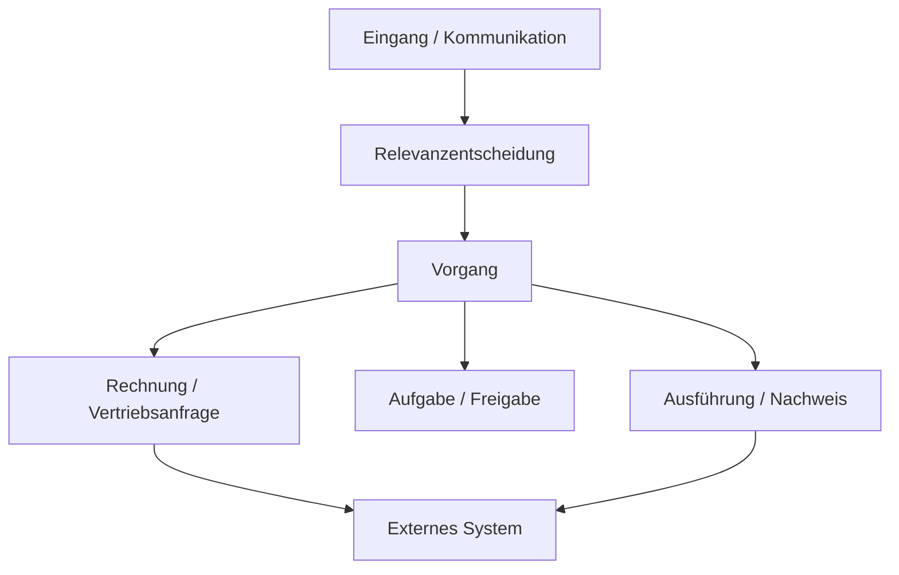

# ORBIT UI/UX DEVELOPMENT SPECIFICATION v2
## Verbindliche Neufassung: verständlicher Arbeitsbereich, kompakte Home-Übersicht und durchgängig erreichbare Sonde

**Unternehmen:** ZERIONUS  
**Produkt:** ORBIT  
**Copilot:** Sonde  
**Version:** 2.0 · Dokumentrevision 2.0  
**Datum:** 05.10.2026  
**Status:** Verbindliche Entwicklungs- und Abnahmespezifikation für Claude Code  
**Ersetzt:** `ORION_UI_UX_DEVELOPMENT_SPECIFICATION_v1.md` vom 27.09.2026 vollständig als UI/UX-Implementierungsdefinition.  
**Dokumenttyp:** Konsolidierte UI/UX-Anpassung und Erweiterung; keine zweite parallel gültige UI-Spezifikation.

---

## 0. Gültigkeit, Quellen und Grenzen der Prüfung

### 0.1 Verbindliche Dokumentenhierarchie

Diese Spezifikation baut auf folgenden tatsächlich gelesenen Dokumenten auf:

| Grundlage | Geltung |
|---|---|
| `ORBIT_MASTER_SPECIFICATION_v3.md`, 27.09.2026 | Produkt, Architektur, Berechtigungen, Domänen, System-of-Record-Grenzen und Qualitätsgates |
| `ORBIT_MASTER_SPECIFICATION_v3_AMENDMENT_01_INTEGRATION_FRAMEWORK_v2.md`, 03.10.2026 | Integrationen, dynamische Kontoidentitäten, Credential-Abstraktion und geführte Einrichtung |
| `ORBIT_MASTER_SPECIFICATION_v3_AMENDMENT_02_BUSINESS_PROCESS_ORCHESTRATION_FRAMEWORK_v1.md`, Dokumentrevision 1.1, 04.10.2026 | Semantische Triage, Cases, adaptive Orchestrierung, Ausführungsnachweise, Betriebsmodi und menschliche Eingriffe |
| `ORION_UI_UX_DEVELOPMENT_SPECIFICATION_v1.md`, 27.09.2026 | Historische UI/UX-Basis; wird durch dieses Dokument ersetzt |

Amendment 02 wurde anhand der bereitstehenden aktuellen Kopie mit dem Dateinamensuffix `(1)` gelesen. Dieser Suffix kennzeichnet eine Dateikopie und keine zusätzliche fachliche Version.

Für fachliches Verhalten gelten Master v3 und die jeweiligen Amendments mit deren eigener Vorrangregel. Für Darstellung, Informationshierarchie, Navigation, Layout und Interaktionen gilt diese UI/UX v2. Keine UI-Regel darf Berechtigungen, Policies, konkrete Aktionsfreigaben, Idempotenz oder Nachweispflichten abschwächen. Fachliche Zustände werden dargestellt, nicht im Frontend erfunden.

Der ältere Referenzentwurf trägt noch den Namen ORION. Das aktuelle Produkt heißt ORBIT. Produktname, Tenantname und Logo werden aus Konfiguration geladen. Beispielnamen und Bildinhalte erzeugen keine neuen Module.

### 0.2 Geprüfte visuelle Ausgangsbasis

- `Screenshot 2026-10-02 210156.png`: ursprünglicher moderner Referenzentwurf mit dunkler Navigation, heller Arbeitsfläche und Sonde rechts.
- `image(20261005-050441).png`: sichtbarer Stand der von Claude umgesetzten Home-Ansicht.

Die Prüfung umfasst die Spezifikationen und die sichtbare Umsetzung im zweiten Screenshot. Es liegt hier kein ORBIT-Repository und keine bedienbare ORBIT-Laufzeit vor. Deshalb sind nicht sichtbare Seiten, Interaktionen, CSS-Ursachen und tatsächliche API-Daten **nicht als geprüft** zu behandeln. Claude muss diese Punkte im Repository und Browser ergänzend prüfen. Das Dokument enthält für alle Bereiche ein verbindliches Zielbild; eine screenshotbasierte Feststellung ist davon ausdrücklich zu unterscheiden.

### 0.3 Bedeutung von MUSS, SOLL und optional

**MUSS** ist ein Abnahmekriterium. **SOLL** ist der Standard; Abweichungen brauchen eine dokumentierte fachliche oder technische Begründung. **Optional** ist kein Hindernis für die Abnahme des hier definierten Pflichtumfangs.

Die Zahlen für Layout und Dichte sind Produktvorgaben dieser Neufassung. Sie sind keine Behauptung über gemessene CSS-Werte des Screenshots.

---

## 1. Ergebnis der Gap-Prüfung

| ID | Sichtbare Beobachtung bzw. Lücke der v1 | Wirkung für Anwender | Verbindliche Änderung |
|---|---|---|---|
| GAP-01 | Der Inhaltsbereich liegt schmal in einer breiten, weitgehend ungenutzten Arbeitsfläche. | Kleine Tabellen trotz großer Anzeige; unnötige Leerräume. | Arbeitsbereich nutzt die verfügbare Breite; kein globales schmales `max-width` auf Home und Listen. |
| GAP-02 | Die Inbox enthält viele hohe Zeilen; Finance/Sales beginnen erst am unteren Bildrand. | Überblick und Prioritäten verschwinden beim Einstieg. | Home bekommt feste Inhaltsbudgets, begrenzte Vorschauen und direkte Links zu vollständigen Listen. |
| GAP-03 | Finance, Sales und Administration zeigen bereits ihre Untereinträge. | Hohe Navigationslast; technische Funktionen stehen früh im Vordergrund. | Alle Navigationsgruppen sind beim ersten Einstieg geschlossen; aktive Detailroute ist die definierte Ausnahme. |
| GAP-04 | Die Home-Inbox hat einen horizontalen Scrollbalken. | Anwender müssen zwischen Spalten hin- und herschieben. | Auf Home nur wenige priorisierte Informationen; Zusatzdaten im Detail. Kein horizontaler Home-Scroll. |
| GAP-05 | Lange Testadressen/IDs umbrechen mehrfach; interne Schlüssel wie `REQUEST_FOR_QUOTE` sind sichtbar. | Zeilen wachsen; technische Darstellung erschwert das Verständnis. | Dynamische Anzeigenamen, begrenzte Zeilen, verständliche deutsche Labels; vollständige Originaldaten im Detail. |
| GAP-06 | Die sichtbare Sonde-Konversation füllt eine lange rechte Fläche; ihre Eingabe ist im Ausschnitt nicht sichtbar. | Der Kommunikationsweg ist nicht zuverlässig unmittelbar erreichbar. | Panel auf Viewporthöhe begrenzen; nur Nachrichten scrollen; Composer bleibt fest im sichtbaren Panel. |
| GAP-07 | Die gesamte UI wirkt im Umsetzungsscreenshot deutlich kleiner und schwächer gewichtet als im Referenzentwurf. | Informationen und Aktionen sind schwerer zu erfassen. | Einheitliche Schrift-, Abstands- und Kontrastvorgaben; Browserzoom separat prüfen, keine Verkleinerung zum Einpassen. |
| GAP-08 | Der Header begrüßt eine technische E-Mail-Adresse. | Technische Identität prägt die Oberfläche. | Profilname bevorzugen; freundlicher neutraler Fallback ohne erfundenen Namen. |
| GAP-09 | Screenshot zeigt 35 Genehmigungen als KPI, während Sonde 26 ausstehende Freigaben nennt. | Unterschiedliche Zahlen ohne erkennbaren Geltungsbereich schwächen Vertrauen. | Gleicher Scope/Zeitraum/Snapshot oder explizite Erklärung der Abweichung. Aus dem Bild allein ist kein Backendfehler bewiesen. |
| GAP-10 | v1 fordert den visuellen Gesamteindruck, aber keine verbindlichen Höhenbudgets oder maximale Vorschauzeilen. | Funktional vollständige Umsetzung kann trotzdem weit vom Zielbild abweichen. | Geometrie, Viewportmatrix, Overflow-Regeln und visuelle Evidenz werden Pflicht. |
| GAP-11 | v1 enthält viele obligatorische Inbox-Spalten und mehrere komplexe Diagramme im Home-Bereich. | Auch das ursprüngliche Mockup ist für kleine Laptops zu dicht. | Felder bleiben verfügbar, werden aber abgestuft präsentiert; Home wird bewusster vereinfacht. |
| GAP-12 | Einzelne Links sind sichtbar; eine konsistente Navigation zwischen fachlichen Objekten ist aus dem Bild nicht nachweisbar. | Risiko isolierter Informationsinseln. | Einheitliche Objektlinks, Kontextvorschau, Deep Links und erhaltener Rücksprung in allen Modulen. |

Die Überarbeitung ist daher mehr als ein Farbwechsel. Sie korrigiert die bisher unzureichend verbindliche Anordnung, begrenzt die Informationsmenge und definiert einen nachvollziehbaren Arbeitsfluss.

---

## 2. Produktprinzipien und Nutzerziele

Zielgruppe sind Unternehmen mit **1–250 Mitarbeitern**, darunter Anwender ohne IT-Fachwissen. Ein Einzelunternehmer braucht dieselbe verständliche Oberfläche wie ein Mitarbeiter eines größeren Teams, mit angepassten Daten und Berechtigungen.

1. **Aufmerksamkeit vor Datenmenge.** Zuerst sichtbar: Was muss ich entscheiden oder ergänzen?
2. **Fachliche Arbeit vor technischer Infrastruktur.** Nutzer sehen Anfrage, Rechnung, Aufgabe, Vorgang und Ergebnis. Agenten, Modellprofile und Laufzeitdiagnostik stehen in erweiterten Details.
3. **Übersicht vor Vollständigkeit auf einer Seite.** Jede Ansicht hat einen eindeutigen Zweck; vollständige Informationen bleiben erreichbar.
4. **Verknüpfungen statt wiederholter Dateneingabe.** Kommunikation, Vorgang, Rechnung/Lead, Aufgabe, Freigabe und externes System bilden einen nachvollziehbaren Zusammenhang.
5. **Ehrliche Ausführung.** „Entwurf“, „Freigegeben“, „Versandt“, „Zustellung unbekannt“ und „Simuliert“ sind unterschiedliche Zustände.
6. **Sonde ist ein kontinuierlicher Arbeitszugang.** Kontext und Gespräch bleiben beim Seitenwechsel erhalten; die Eingabe verschwindet nie unter dem Seiteninhalt.
7. **Flexibilität innerhalb verständlicher Grenzen.** Persönliche Ansichten, Tenant-CI und Größenanpassung dürfen die Prioritäten, Lesbarkeit und Pflichtaktionen nicht zerstören.
8. **Details schrittweise offenlegen.** Überblick → fachliches Detail → erweiterte Nachweise/Diagnostik.

Ein Erstnutzer soll ohne Schulung erkennen können: Wo bin ich? Was benötigt mich? Was erledigt ORBIT? Woher stammt diese Information? Was passiert beim Klick?

---

## 3. Informationsarchitektur und Sprache

### 3.1 Unveränderte Funktionsbereiche, verständliche Beschriftung

Die zehn Top-Level-Bereiche bleiben fachlich erhalten; es werden keine zusätzlichen Produktmodule eingeführt. Bestehende Routen sollen erhalten werden.

| Fachlicher Bereich/Registry-Key | Deutsches Standardlabel | Hauptfrage |
|---|---|---|
| Home | Home | Was ist heute wichtig? |
| Inbox | Posteingang | Was ist eingegangen und was wurde daraus? |
| Finance | Finanzen | Welche Rechnungen und Ausnahmen brauchen Bearbeitung? |
| Sales | Vertrieb | Welche Kundenanfragen und nächsten Schritte sind offen? |
| Approvals | Freigaben | Welche konkrete Entscheidung wird von mir benötigt? |
| Tasks | Aufgaben | Was muss ich bis wann erledigen? |
| Cases | Vorgänge | Wie hängt die Arbeit zusammen und wo steht sie? |
| Activity | Aktivitäten | Was ist tatsächlich passiert? |
| Integrations | Systeme & Verbindungen | Welche vorhandenen Systeme sind verbunden? |
| Administration | Administration | Wie wird ORBIT für das Unternehmen eingerichtet? |

„Vorgang“ ist die deutsche Anzeige eines `Case`, kein zusätzliches Datenobjekt. Ein `Lead` kann je Kontext „Interessent“ heißen; die Domänenlogik bleibt dieselbe. Die vollständige Anzeigezuordnung liegt zentral in i18n/Label-Registry, nie verteilt als Stringersetzung.

### 3.2 Sprachregeln

- Standard: verständliches Deutsch und konsistente Sie-Ansprache; EN wird über i18n unterstützt.
- Aktionen beginnen mit einem Verb: „Rechnung prüfen“, „Antwort vorbereiten“, „Verbindung erneuern“.
- Keine sichtbaren Enum-Schlüssel, UUIDs, Stacktraces, Provider-Fehlertexte oder Dateipfade im Standard-Arbeitsbereich.
- `REQUEST_FOR_QUOTE` → „Angebotsanfrage“, `INVOICE_RECEIVED` → „Rechnungseingang“. Unbekannter Registry-Key → „Noch nicht zugeordnet“, mit Details statt erfundenem Fachlabel.
- „Freigabe“ wird konsistent verwendet; „Genehmigung“ ist kein konkurrierender Begriff im selben Ablauf.
- „Orchestrierung anzeigen“ bleibt der verbindliche Einstieg gemäß Amendment 02; erklärender Zusatz: „Ablauf und nächste Schritte“.
- Ein Fehler nennt das Problem und den nächsten erlaubten Schritt. „CRM-Anmeldung abgelaufen. Bitte Verbindung erneuern.“
- Namen stammen aus Profil/Provider/SoR. Fehlt ein Nutzername, „Guten Morgen“; keine erfundene Person und keine E-Mail als große Überschrift.

---

## 4. Application Shell und nutzbare Breite

### 4.1 Grundaufbau

Ein gemeinsames `AppShell` enthält Navigation links, globalen Header und Arbeitsbereich in der Mitte sowie Sonde rechts. Der Shell-Rahmen orientiert sich an der **tatsächlich verfügbaren CSS-Viewportgröße**, nicht an Displayauflösung oder Screenshotabmessung.

| Element | Standardwert | Verhalten |
|---|---:|---|
| Globaler Header | 56 px | Einzeilig; Suche, Kontext, Benachrichtigungen und Profil; keine zweite permanente Werkzeugzeile |
| Navigation mit Labels | 208 px | Feste Shell-Spalte; Produktidentität unten |
| Kompakte Navigation | 72 px | Optional bei wenig Platz oder persönlicher Auswahl; zugängliche Labels/Tooltips |
| Sonde angedockt | 384 px | Verstellbar, 360–480 px, solange Mindestbreite der Arbeit gewahrt bleibt |
| Main-Padding | 16 px je Seite | Auf sehr großen Anzeigen bis 24 px; Home nutzt übrige Breite |
| Kartenabstand | 12 px | Bei niedriger Höhe 8 px |
| Mindestbreite Hauptinhalt bei Dock | 800 px netto | Darunter Sonde als Overlay oder Vollansicht, nicht durch Schrumpfen aller Inhalte |

Berechnung: `nettoMain = viewportWidth - navWidth - dockedSondeWidth - 2 * mainPadding`. Sonde darf nur dauerhaft angedockt bleiben, wenn `nettoMain >= 800`. Die aktuelle Route kann mehr Platz verlangen, etwa ein Dokumentvergleich; dann nutzt Sonde Overlay. Ein manueller Resize überschreitet diese Grenze nicht.

Bei 1440 px mit Navigation 208, Sonde 384 und Padding 16 bleiben 816 px netto. Bei 1280 px bleiben in derselben Konfiguration 656 px; Sonde wird daher überlagert geöffnet, nicht in eine zu schmale Arbeitsfläche gezwängt. Ein ausdrücklich gewählter Rail-Modus darf Docking erlauben, sobald die tatsächliche Rechnung erfüllt ist.

### 4.2 Breitenregeln

**SHELL-01:** Home und Listen nutzen `width: 100%` des Arbeitsbereichs. Kein zentrierter schmaler Artikelcontainer. Formulare und Lesetexte dürfen eine eigene Lesebreite besitzen.

**SHELL-02:** Flex-/Grid-Kinder bekommen geeignete `min-width: 0` und `min-height: 0`. Lange Daten dürfen weder Grid noch Panel aufziehen.

**SHELL-03:** Beim Öffnen/Schließen von Sonde reagiert das Inhaltslayout; keine feste Hauptbreite, kein überdeckter primärer Aktionsbereich im Dock-Modus.

**SHELL-04:** Hauptinhalts-Containerabfragen bzw. gemessene verfügbare Breite steuern Tabellen und Karten. Ein Viewportbreakpoint allein reicht nicht, wenn Sonde und Navigation Breite belegen.

### 4.3 Scroll-Verantwortung

| Bereich | Erlaubtes Scrollen |
|---|---|
| Shell/Dokument-Body auf Desktop | Kein vertikales Body-Scrollen; Shell passt in Viewport |
| Home im Standardprofil auf Desktop | Kein vertikales/horizontales Scrollen; begrenzte Vorschauen |
| Modul-Arbeitsbereich | Eigener vertikaler Scrollbereich für lange Listen/Details |
| Navigation | Eigener Scrollbereich nur wenn Höhe oder Berechtigungsmenge dies erfordert |
| Sonde | Nachrichtenbereich scrollt; Header, Kontext und Composer bleiben sichtbar |
| Datenraster/Prozessgraph/Dokumentviewer | Eigener klar erkennbarer Scroll-/Panbereich, wenn fachlich erforderlich |

Keine zwei ineinanderliegenden vertikalen Scroller für dieselbe Liste. Ein Dokumentviewer kann neben einer unabhängig scrollenden fachlichen Detailspalte existieren; beide brauchen erkennbare Grenzen.

---

## 5. Navigation: geschlossen starten, Orientierung erhalten

### 5.1 Startzustand

**NAV-01:** Bei erstmaligem Einstieg auf Home sind **alle Untermenüs geschlossen**. Die Top-Level-Namen bleiben sichtbar. „Eingeklappt“ bedeutet geschlossene Funktionsgruppen und nicht automatisch eine reine Iconleiste.

**NAV-02:** Auf Home wird keine Gruppe automatisch geöffnet, nur weil der Nutzer zuvor in Finance oder Administration war. Persistiert werden dürfen Rail/Label-Präferenz und Favoriten, nicht ein ungefragt vollständig aufgeklappter Baum.

**NAV-03:** Bei direktem Einstieg auf eine Unterseite ist die aktive Gruppe die Ausnahme: Sie öffnet sich, markiert die aktive Seite und erklärt den Ort. Alle anderen Gruppen bleiben geschlossen. Kehrt der Nutzer zu Home zurück, schließen die Gruppen wieder.

### 5.2 Interaktion

- Fachlicher Gruppenname navigiert zur jeweiligen Übersichtsseite; eigener Chevron klappt die Unterseiten auf/zu. Beide haben getrennte Tastatur- und Screenreaderlabels.
- Standard: höchstens eine manuell geöffnete Gruppe. Diese Regel reduziert Suchaufwand, ohne Funktionen zu entfernen.
- Kein zusätzliches Untermenü für ein Modul ohne Unterseiten.
- Maximal zwei Ebenen in der Sidebar. Tiefere Administration erfolgt auf der Admin-Seite.
- Die aktive Detailroute erhält ihre Hauptgruppe auch dann, wenn kein exakter Menüeintrag existiert.
- Rail-Modus: Fokus/Klick öffnet ein zugängliches Flyout mit Label und Unterseiten; nicht nur Hover.
- Notification-Badges zeigen möglichst kleine relevante Counts, z. B. meine Freigaben. Counts und Menütext brauchen gleiche Berechtigungen.
- „Systeme & Verbindungen“ und „Administration“ stehen unter einem dezenten visuellen Trenner. Nicht-Admins erhalten keine technische Admin-Navigation.
- Kontext-Favoriten sind optional; sie werden innerhalb bestehender Bereiche verwaltet und erzeugen keine elfte Hauptnavigation.

### 5.3 Suche als zweiter Zugang

Die globale Suche findet berechtigte Vorgänge, Rechnungen, Kontakte, Aufgaben und Freigaben. Resultate zeigen Typ, verständlichen Titel, Status und direkte Route. Sie ersetzt nicht die sichtbare Navigation. Tastaturzugang ist ergänzend; kein Enduser muss Shortcuts kennen.

Ist globale Suche noch nicht implementiert, wird keine funktionierende Suche vorgetäuscht. Claude implementiert den notwendigen Zugriff oder dokumentiert die Funktion sichtbar als nicht verfügbar; eine tote Suchbox ist keine Abnahme.

---

## 6. Home: eine Bildschirmseite mit klarer Priorität

### 6.1 Zweck und verbindliche Reihenfolge

Home ist eine **Arbeitsübersicht**, keine verkleinerte Vollansicht sämtlicher Module. Sie zeigt folgende Bereiche:

1. Kompakter Seitenkopf mit Begrüßung, Zeitraum und „Ansicht anpassen“.
2. Fünf zusammengehörige KPIs.
3. Zwei Vorschauen nebeneinander: **„Benötigt Ihre Aufmerksamkeit“** und **„Neu im Posteingang“**.
4. Zwei kompakte Bereichskarten: **Finanzen** und **Vertrieb**, soweit berechtigt.
5. Eine schmale Abschlusszeile: **„Ihre nächsten Aufgaben“** und **„Zuletzt erledigt“**.

Diese Reihenfolge ersetzt die exakte Home-Komposition der v1. Die Aufmerksamkeit kommt vor umfangreichen Datenlisten. Freigaben sind in der Aufmerksamkeitskarte integriert; alle Freigabedetails bleiben im Freigabecenter erreichbar. Die Aktivitätsvorschau steht in „Zuletzt erledigt“; ihr vollständiger Stream bleibt im Aktivitätenbereich.

### 6.2 Verbindlicher Layoutplan

| Home-Zeile | Linke Fläche | Rechte Fläche | Höhe bei kompakter Desktopdarstellung |
|---|---|---|---:|
| Seitenkopf | Begrüßung | Zeitraum, Anpassung | 44 px |
| KPIs | Fünf gleichwertige Karten über die gesamte Breite | – | 80 px |
| Arbeit jetzt | Aufmerksamkeit, 50 % | Neue Eingänge, 50 % | 176 px |
| Fachbereiche | Finanzen, 50 % | Vertrieb, 50 % | 144 px |
| Nächste Schritte | Meine Aufgaben, 50 % | Zuletzt erledigt, 50 % | 80 px |

Bei 720 px Viewporthöhe sind unter dem 56-px-Header und 2 × 16-px-Padding 632 px verfügbar. Die fünf Zeilen brauchen 524 px, vier 12-px-Abstände 48 px: insgesamt **572 px**. Es bleibt Reserve; das Layout darf sie nutzen, aber nicht durch zusätzliche Tabellenzeilen verbrauchen. Das ist eine konstruierte Zielgeometrie, kein nachträgliches Skalieren eines langen Dashboards.

Bei 900/1080 px Höhe werden einzelne Vorschauen größer und erhalten bis zu fünf Einträge. Der zusätzliche Raum bleibt geordnet; keine beliebige Liste wächst bis zur gesamten Höhe. Auf ultrabreiten Bildschirmen bleiben lesbare Proportionen und größere Kartenbreiten; keine tiny UI in der Mitte.

### 6.3 Vorschaugrenzen nach Höhe

| Netto-Arbeitsbereichshöhe nach Header/Padding | Aufmerksamkeit | Inbox | Aufgaben | Aktivitäten |
|---|---:|---:|---:|---:|
| 620–719 px | 3 | 3 | 1–2 | 1–2 |
| 720–899 px | 4 | 4 | 2 | 2 |
| Ab 900 px | Max. 5 | Max. 5 | Max. 3 | Max. 3 |

Nettohöhen unter 620 px nutzen eine zusätzliche Kompaktregel: je 2 Aufmerksamkeit/Inbox, kompakte Fachkarten, Abschlusszeile mit Count und Link. Reicht dies bei zugänglicher Schrift nicht aus, ist vertikales Scrollen zulässig. Die niedrige Sonderhöhe ist keine Rechtfertigung für Scrollen bei 1280×720 und größer.

**HOME-01:** Das Standardprofil passt bei 1280×720, 1366×768, 1440×900, 1600×900 und 1920×1080 bei 100 % Browserzoom auf eine Bildschirmseite, ohne Home-/Body-Scroll und ohne verdeckte Bereiche. Sonde-Docking folgt der Breitenregel, Overlay überdeckt beim Öffnen bewusst einen Teil der Seite und ersetzt nicht deren Grundlayout.

**HOME-02:** Mehr Daten ändern Counts und „Alle anzeigen“, nicht die Home-Höhe. Die Startansicht benötigt keine interne Tabellen-Scrollfläche.

**HOME-03:** Bei Tablet, Mobile, starkem Zoom, längeren Übersetzungen oder Barrierefreiheits-Reflow darf Home vertikal scrollen. Vollständige Lesbarkeit und Tastaturzugang haben Vorrang vor dem Desktop-Einbildschirmziel. Kein `overflow: hidden`, das fachliche Inhalte abschneidet.

**HOME-04:** Keine horizontalen Scrollbalken auf Home; keine Schriftverkleinerung oder CSS-Transforms, um mehr Daten unterzubringen.

### 6.4 Kompakter Seitenkopf

„Guten Morgen, {Profilvorname}“ plus eine kurze sekundäre Statuszeile. Fehlt ein Vorname: „Guten Morgen“. Zeitraum „Heute“ mit lokalem Datum ist sichtbar; keine zweite große Welcome-Zeile. Die Home-Anpassung ist ein sekundärer Menüpunkt, kein dominanter Call-to-Action.

### 6.5 Aufmerksamkeit als primäre Arbeitskarte

Einträge sind fachliche Handlungsbedarfe: Freigabe, fehlende Information, Frist, blockierte Verbindung oder ungewisses Ergebnis. Derselbe Vorgang erscheint nicht mehrfach wegen zugehöriger Aufgabe plus Freigabe, wenn dieselbe menschliche Handlung gemeint ist. Der Eintrag erklärt seine zugrunde liegenden Objekte und verbleibende Anzahl.

Jede Zeile enthält einen kurzen Titel, Grund/Frist, verständlichen Status und einen eindeutigen Link wie „Prüfen“. Kritischer Handlungsbedarf wird durch Symbol und Text sichtbar. Sortierung: Sicherheits-/kritische Risiken, Fristüberschreitung, heute fällig, übrige; Tie-Breaker stabil. Ein Zahlwert wird nicht nur nach beliebigen LLM-Prioritäten sortiert.

„35 offene Freigaben“ als Link führt zur vollständigen passenden Queue. Home genehmigt nicht blind per Ein-Klick-Shortcut. Kritische Details und konkreter Payload werden im Freigabedetail gezeigt.

### 6.6 Home-Inbox als Vorschau, keine breite Tabelle

Jeder Eintrag zeigt maximal: Quellensymbol, Anzeigename, fachlichen Betreff/Titel, Status und Zeitpunkt. Ein optionaler Satz nennt die nächste Aktion. Agent, Confidence, Originaladresse und technische Klassifikation gehören in Details.

Die Zeile hat maximal zwei Textzeilen, im kompakten Profil etwa 40 px Höhe. Betreff/Absender werden sinnvoll gekürzt; vollständiger Text ist über fokussierbare Vorschau bzw. Detail erreichbar. Eine zeilenbrechende UUID-Testadresse darf die Zeile nicht aufziehen. Es wird kein gefälschter Name aus einer E-Mail konstruiert.

Bei vorhandenen Cases enthält jede Zeile den Link **„Orchestrierung anzeigen“**; auf engem Raum als klar beschriftete Aktion in der Kontextvorschau. Ohne Case gibt es „Entscheidung ansehen“. Der primäre Zeilenlink öffnet den Eingang; die Orchestrierungsaktion öffnet direkt den Prozess-Tab. Beide dürfen keine ungültige verschachtelte Linkstruktur erzeugen.

### 6.7 Finance-/Sales-Karten

Je Bereich maximal drei Werte und ein kurzer fachlicher Hinweis mit Link. Keine Donut-, Transfer-, Timeline- und Detailtabelle gleichzeitig auf Home.

- Finanzen: „Zu prüfen“, „Freigabe offen“, „Zur Buchhaltung übertragen“. Hinweis z. B. tatsächliche Bankänderungswarnung mit Link zur betroffenen Rechnung.
- Vertrieb: „Neue Anfragen“, „Rückmeldungen offen“, „Heute fällige nächste Schritte“. Hinweis z. B. berechtigter Vorgang mit nächster Aktion.
- Fehlt ein Bereich wegen Berechtigungen, erhält der andere sinnvollen Raum; keine leere verbotene Karte. Keine zusätzlichen fachlichen Kennzahlen erfinden, wenn der Backendvertrag sie nicht liefert.
- Charts gehören auf Bereichsübersichten oder in explizite optionale Ansichten, nicht in die Standard-Home-Abnahme.

### 6.8 Aufgaben und zuletzt erledigte Arbeit

Die Abschlusszeile ist eine knappe Vorschau. Aufgaben nennen Fälligkeit und verwandten Vorgang; Aktivitäten nennen das bestätigte Ergebnis und Zeitpunkt. „E-Mail versandt“ benötigt Versandnachweis. Bloße Klassifikation wird nicht als abgeschlossener Kundenprozess bezeichnet.

---

## 7. KPI-Vertrag und konsistente Zahlen

Fünf Standard-KPIs bleiben aus Master/v1 erhalten, werden aber fachlich präzisiert:

| KPI | Standardanzeige | Zählbasis/Link |
|---|---|---|
| Verarbeitete Posten | Anzahl fachlich relevanter bearbeiteter Eingänge im Zeitraum | Eingangsliste mit genau diesem Filter; keine automatische Gleichsetzung mit abgeschlossenen Cases |
| Automatisiert | Vollständig ohne menschlichen Eingriff abgeschlossene fachliche Prozesse; Count, ggf. Anteil | Erfolgreich abgeschlossene Cases; Nenner/Zeitraum für Prozent explizit |
| Freigaben offen | Zum Snapshot offene Freigaben im erlaubten Scope | Freigabecenter; eigener Filter „Meine“ bzw. „Team“ ist sichtbar |
| Fehler/ungeklärte Ergebnisse | Aktuell betroffene Vorgänge, nicht Zahl sämtlicher Retry-Attempts | Aufmerksamkeit/Fehlerliste; unbekannte externe Wirkung fachlich getrennt erläutern |
| Geschätzte Zeitersparnis | Konfigurierte Schätzung auf tatsächlich bestätigter Arbeit | Berechnungsdetails, Zeitraum, Annahmen; keine Garantie und kein erfundener Trend |

Diese Zählregeln ergänzen die alten generischen KPI-Namen. Claude muss vorhandene Datenmodelle und Berechnungen prüfen, einen eindeutigen Backendvertrag dokumentieren und Abweichungen migrieren. Eine CSS-Änderung behebt keine widersprüchlichen Kennzahlen.

Counts dürfen unterschiedliche Zeitbezüge haben, z. B. „Heute bearbeitet“ und „Aktuell offene Freigaben“. Das steht unter dem Wert. Der Zeitraumfilter verändert nur Kennzahlen mit Zeitraumbezug; Bestandscounts bleiben explizit „Aktuell“. Nicht unterstützte Metrik → „Noch nicht verfügbar“, nicht 0.

**DATA-01:** Home, Modulfilter und Sonde verwenden denselben autorisierten fachlichen Query-Service oder eine nachweislich identische Definition. Scope enthält Tenant, Benutzer/Rechte, Zeitraum/Zeitzone und Snapshotzeitpunkt.

**DATA-02:** Alle Karten und Sonde zeigen einen konsistenten „Stand“. Bei älteren Daten sichtbar „Stand 07:12“ oder „Wird aktualisiert“. Änderungen zwischen Chatantwort und UI werden erklärt bzw. aktualisiert, nicht verdeckt.

**DATA-03:** Kategorien „gesichtet“, „ausgefiltert“, „Case gestartet“, „Prozess abgeschlossen“ bleiben getrennt. `IntakeEvent.COMPLETED` zählt nicht als erfolgreicher fachlicher Abschluss.

**DATA-04:** Trends erscheinen nur bei vorhandener echter Vergleichsbasis. Die ursprünglichen Mockup-Zahlen und Pfeile sind keine Produktvorgabe.

---

## 8. Sonde: immer erreichbar und sichtbar bedienbar

### 8.1 Panel-Aufbau und Größen

Von oben nach unten:

1. Header: Sonde, tatsächlicher Bereitschaftsstatus, neue Unterhaltung/Verlauf und Schließen.
2. Kompakte Kontextzeile: aktuelle Seite bzw. verknüpftes Objekt; „Kontext ändern“.
3. Moduswahl mit verständlichen Labels.
4. Flexibler Nachrichtenbereich, ausschließlich dieser scrollt.
5. Begrenzter Bereich für die aktuelle Aktion/ausstehenden Entwurf, sofern vorhanden.
6. Composer mit Eingabe und Sendeschaltfläche; optionale Vorschlagschips direkt darüber.

**SONDE-01:** Panelhöhe entspricht dem verfügbaren Viewport unter dem Header, nicht der gesamten Home-/Seitenhöhe. Struktur konzeptionell: `grid-template-rows: auto auto auto minmax(0, 1fr) auto auto`. Kein Composer nach einer unbegrenzten Liste im normalen Dokumentfluss.

**SONDE-02:** Composer ist in jeder geöffneten Darstellung sichtbar, bei langen Threads, Streaming, Seitenwechsel, Browserresize und Bildschirmtastatur. Eingabe wächst begrenzt auf etwa 3–5 Zeilen; danach scrollt sie selbst. Mindestens eine nutzbare Nachrichtenfläche bleibt vorhanden.

**SONDE-03:** Schließen stoppt weder persistierte Workflows noch löscht es den Gesprächsverlauf. Beim Wiederöffnen ist der Entwurf erhalten. „Neue Unterhaltung“ setzt nicht unbeabsichtigt einen laufenden Auftrag zurück.

### 8.2 Darstellungszustände

| Zustand | Verhalten |
|---|---|
| Angedockt | Eigene Shell-Spalte, Standard 384 px; Hauptbereich behält Mindestbreite |
| Eingeklappt | Klar beschrifteter Sonde-Button im Header, ggf. Badge für ausstehende Antwort; jederzeit erreichbar |
| Overlay | Rechtes Sheet, 360–480 px innerhalb des Viewports; Fokusmanagement und sichtbares Schließen |
| Erweitert | Bis 40 % der Viewportbreite, nur wenn Hauptinhalt ausreichend Platz behält; sonst Vollansicht/Overlay |
| Mobile | Erreichbarer Sonde-Button → Sheet oder Vollansicht; Composer oberhalb der Tastatur und Safe Area |

Erster Einstieg ab ausreichender Breite: Sonde angedockt offen. Bei schmaler Breite: Sonde eingeklappt mit sichtbarem Zugang. Persönliche Offen/Geschlossen-Präferenz bleibt erhalten, wird bei Platzmangel in eine zulässige Darstellung überführt. Nutzer verlieren nie ungesendeten Text durch automatischen Layoutwechsel.

### 8.3 Modi ohne technische Einstiegshürde

Die vorhandenen fünf Modi bleiben erhalten. UI-Labels: **Fragen (Ask), Vorbereiten (Prepare), Ausführen (Act), Beauftragen (Delegate), Navigieren (Navigate)**. Interne Keys bleiben unverändert. Standard ist „Fragen“.

Auf schmalem Panel ist der aktive Modus plus verständliches Auswahlmenü sichtbar; keine fünf abgeschnittenen englischen Tabs. Fähigkeiten werden aus Backend-Capabilities abgeleitet. Fehlende Rechte machen nicht alle Modi zu scheinbar funktionierenden Buttons.

Ein Moduswechsel ersetzt keine Policy. „Ausführen“ heißt nicht, dass eine externe Aktion ohne die erforderliche konkrete Freigabe ausgeführt werden darf. Eine natürliche Nutzeranfrage kann einen passenden Vorschlag auslösen; Sonde erklärt den nächsten Schritt, statt Nutzer zwingend die technische Moduslogik verstehen zu lassen.

### 8.4 Gespräch, Kontext und sichere Navigation

- Gespräch und Eingabe bleiben beim Routewechsel erhalten. Kontextzeile zeigt den aktuellen Kontext.
- Jeder versandten Nachricht wird ein validierter Kontextsnapshot zugeordnet. Bereits laufende Anfrage/Action bekommt beim späteren Seitenwechsel keine neue Rechnung untergeschoben.
- Eine ausdrücklich fixierte Objektfrage zeigt „Kontext fixiert: Rechnung …“. Wechsel zur neuen Seite ändert diesen Kontext nur über die sichtbare Auswahl.
- Objektbezüge sind echte `EntityLink`s. Referenzen sind strukturiert und autorisiert, keine vom LLM frei erfundenen Routen.
- Sonde nennt Datenquelle und Stand, wenn diese für die Antwort entscheidend sind. Auf „Wurde die Mail wirklich versandt?“ verweist sie auf den konkreten Action-Nachweis und unterscheidet Entwurf, Simulation und bestätigten Versand.
- Ist eine Information nicht verfügbar, sagt Sonde das und bietet eine erlaubte Detailansicht an. Keine plausible Ersatzbehauptung.
- Wenn der Nutzer ältere Nachrichten liest, erzwingt Streaming kein Scrollen nach unten. Ein Button „Neue Antwort“ führt zur neuen Nachricht. Composer bleibt sichtbar.
- Lange Antworten bekommen eine kurze Kernaussage und geordnete Details; umfangreiche Arbeitsergebnisse lassen sich in verknüpften Ansichten öffnen.

### 8.5 Action Cards und Fortschritt

Strukturierte Karten zeigen: konkrete Aktion, betroffene Objekte, Parameter, Status und erlaubte nächste Schritte. Vor Mailversand: Empfänger, Betreff, Text, Anhänge/Version. Vor Termin: Teilnehmer, Datum, Zeitzone, Dauer, Ort/Link. Vor Übertragung: Beleg und Zielsystem.

Buttons heißen „Entwurf öffnen“, „Freigabe prüfen“, „Genehmigen & ausführen“ oder „Fortschritt anzeigen“. Kein generisches „OK“, das eine unbekannte Wirkung auslöst. Aktionen stammen aus serverseitigen `availableActions` und werden dort erneut validiert.

Ein beauftragter Prozess zeigt eine kleine persistente Fortschrittskarte mit Vorgangslink. Chat-Streaming, Workflow-Ausführung und externe Wirkung haben getrennte Zustände. „Antwort stoppen“ bricht nur die Antwortgenerierung ab; „Vorgang pausieren/abbrechen“ ist ein eigener fachlicher Command.

### 8.6 Status und Fehler

„Bereit“ benötigt tatsächliche Provider-/Capability-Bereitschaft. „ORBIT Managed AI“ ist die Konfigurationsart, kein Health-Nachweis. Bei Ausfall bleibt die Eingabe bzw. ihr Inhalt erhalten; Hinweis und zulässiger Wiederholungsweg sind sichtbar. Keine Credential-Eingabe im freien Sonde-Chat. Sonde öffnet bei Setup den sicheren Wizard gemäß Amendment 01.

---

## 9. Vernetztes System: Links, Vorschau und Rücksprung

### 9.1 Fachliches Verknüpfungsmodell

Der Vorgang ist der fachliche Zusammenhang. Ein Eingang kann zu einem Vorgang gehören; der Vorgang verbindet Geschäftsdokumente, Personen/Unternehmen, Aufgaben, Freigaben und externe Ausführungsnachweise. Nicht jede Mail hat einen Vorgang. Stammdaten werden aus dem SoR gelesen, nicht als konkurrierendes CRM/ERP in ORBIT verwaltet.



### 9.2 Einheitliche Objektlinks

**LINK-01:** Jede sichtbare identifizierte Referenz auf Vorgang, Rechnung, Lead, Unternehmen, Kontakt, Aufgabe, Freigabe oder Dokument ist ein echter Link, sofern eine erlaubte Zielansicht existiert. Namen statt isolierter technischer IDs; fachliche Nummer ergänzend.

**LINK-02:** Beziehungen dürfen nicht allein in unstrukturiertem Fließtext versteckt sein. Jede Detailseite besitzt einen kompakten Abschnitt „Verknüpft“ mit relevanten Objekten und Counts. Keine seitenlange universelle Beziehungsmap als Standard.

**LINK-03:** Kein Recht auf Detaildaten → keine unzulässigen Namen/Counts/Preview-Daten. Ist ein fachlicher Hinweis erlaubt, aber das Ziel nicht, erscheint eine neutrale Zugriffsinfo. Links umgehen keine serverseitige Autorisierung.

**LINK-04:** Interne Links unterstützen Taböffnung und kopierbare Deep Links. Routen-ID allein gewährleistet keinen Zugriff. Externe SoR-Links sind providerseitig validiert/allowlisted, klar als extern gekennzeichnet und funktionieren nur, wenn der Provider eine passende Route anbietet.

### 9.3 Vorschau versus vollständiges Detail

- Primärer Titel öffnet das fachliche Detail.
- Eine separate Vorschauaktion öffnet einen Drawer für kurze Zusammenfassung, Status, nächste Aktion und „Vollständige Details“.
- Keine Drawer-in-Drawer-Kaskaden. Ein neuer Vorschaukontext ersetzt den alten nachvollziehbar; umfangreiche Bearbeitung wechselt in die Detailseite.
- Bei Sonde plus Detailpanel und zu schmalem Raum nutzt die Vorschau ein Overlay oder die volle Seite. Nie drei unlesbare Spalten erzwingen.
- Tooltip ist Ergänzung, kein einziger Zugang zu vollständigem Inhalt auf Touch/Keyboard.

### 9.4 Kontext erhalten

Nach Rücksprung bleiben Filter, Suche, Sortierung, Pagination, ausgewähltes Objekt und Scrollposition bestehen. Teilen/Kopieren eines Links transportiert keine fremden Nutzersessions oder Secrets. Breadcrumbs zeigen fachlichen Weg; Browser-Zurück funktioniert. Wird das Objekt gelöscht oder die Berechtigung entzogen, erscheint eine klare sichere Meldung und ein Rückweg zur Liste.

---

## 10. Gemeinsames Muster für sämtliche Modulansichten

Jede Bereichsübersicht besitzt einen Seitentitel mit kurzer Zweckbeschreibung, maximal drei relevante Kennzahlen, eine Filter-/Suchzeile und einen dominanten Arbeitsbereich. Große KPI-Blöcke werden nicht auf jeder Detailseite wiederholt.

Jede Detailseite beginnt mit:

1. Fachlicher Titel und Identität.
2. Status, Verantwortlicher, Fälligkeit/letzte Aktualisierung.
3. Blockierungsgrund oder nächste erforderliche Handlung.
4. Eine primäre Aktion und wenige sekundäre Aktionen.
5. Fachliche Details, Quellen, Verknüpfungen und Historie, abgestuft in Tabs/Abschnitte.

Nicht alle Tabs werden gleichzeitig vollständig gerendert. Lange Inhalte können im Arbeitsbereich scrollen. Das Einbildschirmziel gilt für Home, nicht für vollständige Rechnungen oder komplexe Prozessgraphen.

Gemeinsame Komponenten: `PageHeader`, `AttentionBanner`, `StatusBadge`, `EntityLink`, `EntityPreview`, `AvailableActionMenu`, `SourceReference`, `LastUpdated`, `EmptyState`, `ErrorState` und `PermissionState`.

---

## 11. Posteingang: aus Eingang wird nachvollziehbare Arbeit

### 11.1 Standardansicht

Inbox dient zur Sichtung, nicht zum Lesen technischer Agentläufe. Standard zeigt berechtigte geschäftsrelevante und ungeklärte Eingänge. Filter: „Benötigt Aufmerksamkeit“, „Neu“, „In Bearbeitung“, „Abgeschlossen“, „Finanzen“, „Vertrieb“; ergänzende Filter nach Quelle/Datum/Verantwortung.

Primärspalten: Quelle, Absender + Betreff, fachlicher Typ, Status/nächster Schritt, Zeitpunkt, **Orchestrierung**. Am schmalen Hauptbereich wird daraus eine zweizeilige Liste mit denselben Kerninformationen. Zusätzliche Felder aus Master/v1 – Agent, menschliche Aktion, Confidence, Case-ID – bleiben über Spaltenwahl/Detail erreichbar; sie sind nicht sämtliche Pflichtspalten im Standard.

### 11.2 Eingangdetail

Quelle und Originalkommunikation, Anhänge, kurze fachliche Einordnung, zugeordneter Vorgang, relevante Facts mit Quellen, aktueller Bearbeitungsstand. Aktion „Orchestrierung anzeigen“ öffnet `/cases/{caseId}/orchestration` bzw. bestehendes äquivalentes Routing direkt auf dem richtigen Tab.

Für nicht geschäftsrelevante Eingänge ohne Case: „Entscheidung ansehen“ mit Begründung, Relevanz, Quellen und **„Aktion: Keine“**. Keine erfundene Prozessgrafik.

Im Produktivbetrieb bleiben sicher ausgefilterte Eingänge standardmäßig verborgen. Berechtigte Reviewer/Admins können „Kein Geschäftsprozess ausgelöst“ gezielt einblenden. Unklare geschäftliche Anliegen bleiben sichtbar. Im Testbetrieb kann dieser Bereich explizit aktiviert sein. Nicht geschäftsrelevant bedeutet keine Löschung im Ursprungspostfach.

---

## 12. Finanzen: Beleg, Ausnahme und nächster Schritt

### 12.1 Übersicht

Default „Zu bearbeiten“; weitere Tabs/Filter „Alle Rechnungen“, „Freigabe offen“, „Übertragen“, „Ausnahmen“. Eine Tabelle zeigt Lieferant/Rechnungsnummer, Betrag/Währung, Fälligkeit, Status und nächste Aktion. Lieferantenansicht bietet dynamisch gelesenen SoR-Kontext und betroffene Vorgänge; sie wird keine zweite Stammdatenpflege.

### 12.2 Rechnungdetail

Desktop bei ausreichender Inhaltsbreite: Dokument links, fachliche Daten rechts. Bei wenig Raum: Tabs „Beleg“ und „Daten“, kein winziger PDF-Viewer. Status/Aufmerksamkeitskarte und erlaubte Hauptaktion stehen oberhalb.

**Standard sichtbar:** Lieferant mit Link, Rechnungsnummer, Betrag/Währung, Datum, Fälligkeit, Prüfergebnis, erforderliche Entscheidung, Buchungsvorschlag und Transferstatus.

**Bei Bedarf öffnen:** Positionen, Netto/Steuer/Brutto, Zahlungsbedingungen, IBAN und Bankänderungsprüfung, Dublettenvergleich, Quellen/Extraktion, Confidence-Hinweis, Freigabehistorie, Orchestrierung und Audit.

Kritische Risiken wie Bankänderung werden nicht in eingeklappten Details versteckt. Sie zeigen alte/neue Information aus zulässigen Quellen und den konkreten Prüfbedarf. Kein Zahlungsbutton: autonome Zahlung bleibt im MVP gesperrt. „Zur Buchhaltung übertragen“ heißt nicht „Bezahlt“. Eingaben/Änderungen verwenden die vorhandenen Domänencommands und Freigabebindung.

---

## 13. Vertrieb: Anfrage, Kundenkontext und nächste Aktion

### 13.1 Übersicht

Default „Offene Anfragen“ mit verständlichem nächsten Schritt. Filter „Neu“, „Antwort fehlt“, „Heute fällig“, „Abgeschlossen“; vorhandene Leads/Opportunities/Kontakte bleiben als Unterseiten erhalten. Eine optionale Boardansicht nutzt vorhandene fachliche Zustände, keine erfundenen Funnelstufen.

### 13.2 Detail

Standard zeigt Kontakt/Unternehmen, Anliegen, Quelle, nächste Handlung, Verantwortung, Fälligkeit und SoR-/CRM-Status. Kommunikation und zugehöriger Vorgang sind direkt verlinkt. Zusatzbereiche: Zusammenfassung/Intent, Angebot/Entwürfe, Termine, Aufgaben und tatsächliche CRM-Updates.

Facts unterscheiden „bestätigt“ und „noch zu prüfen“. Fehlt eine eindeutige CRM-Zuordnung, bleibt der Konflikt sichtbar. „Neuer Interessent“ ersetzt nicht ungeprüft einen vorhandenen Kunden. „Hot/Warm“ erscheinen nur bei tatsächlich vorhandener fachlicher Definition. Auftragserfassung oder Neukundenanlage nutzt registrierte Capabilities und Policy; keine zusätzliche lokale CRM-Pflege.

---

## 14. Freigaben: konkrete Entscheidung mit vollständigem Kontext

### 14.1 Queue

Standard „Meine offenen Freigaben“. Berechtigte Nutzer können Team/alle zugänglichen Freigaben wählen. Zeilen: angeforderte Aktion, betroffene Person/Firma oder Geschäftsobjekt, Betrag sofern relevant, Grund/Risiko, Frist und Status. Confidence und Policy-Details stehen im Detail, nicht als scheinbarer Freigabeautomatismus in jeder Zeile.

### 14.2 Entscheidungdetail

Vor jeder Entscheidung sichtbar: Was wird getan? Für wen? Mit welchen Daten/Dokumenten? In welches System? Warum ist meine Freigabe notwendig? Was passiert danach?

Aktionen: „Genehmigen & ausführen“, „Bearbeiten & genehmigen“, „Ablehnen“, soweit serverseitig erlaubt. Bei rein interner Planfreigabe heißt es „Plan freigeben“; Aktionsfreigaben bleiben separat. Ablehnung fragt einen fachlichen Grund ab, soweit erforderlich.

Bei veraltetem Payload/Plan: „Diese Freigabe wurde durch eine Änderung ersetzt. Bitte aktuelle Version prüfen.“ Keine Erfolgsmeldung bevor der serverseitige Command bestätigt ist. Danach kann die Ausführung noch laufen; „Genehmigt“ und „Ausgeführt“ werden getrennt angezeigt. Bulk-Freigabe kritischer externer Actions ist kein Pflichtumfang dieser UX-Neufassung.

---

## 15. Aufgaben: meine Arbeit zuerst

Default „Meine Aufgaben“, geordnet nach überfällig/heute/später. Zeile: Titel, Fälligkeit, Status, verknüpfter Vorgang und nächste Aktion. Filter nach Verantwortlichem, Bereich und Status. Teamansicht nur bei Berechtigung.

Eine Aufgabe erklärt, welches konkrete Ergebnis benötigt wird. Informationen ergänzen, Entwurf prüfen oder Freigabe öffnen sind fachliche Ziele. Aufgabe und Freigabe verlinken sich, wenn sie denselben Bedarf betreffen. Es gibt keinen allgemeinen „Erledigt“-Button, der einen ungeprüften Geschäftsprozess erfolgreich setzt. Abschluss folgt dem existierenden Task-/Capabilityvertrag; notwendige Nachweise bleiben erhalten.

Kalender-/Boardansichten sind optional und dürfen nicht Voraussetzung für verständliche Standardarbeit sein.

---

## 16. Vorgänge und Orchestrierung: vernetzte Arbeit verstehen

### 16.1 Vorgangsübersicht

Zeilen: fachlicher Titel/Ziel, relevante Firma/Person, Status, nächster Schritt/Wartegrund, Verantwortlicher und Aktualität. Default „Offene Vorgänge“; Aufmerksamkeitsfilter erreichbar. Keine Standardliste von AgentRun-IDs.

### 16.2 Vorgangsdetail und Tabs

Kopf und Aufmerksamkeitskarte bleiben klar erkennbar. Tabs: **Überblick, Orchestrierung, Kommunikation, Dokumente, Historie**. Einstieg aus „Orchestrierung anzeigen“ aktiviert direkt den Orchestrierungs-Tab; kein zusätzlicher Suchschritt.

Überblick beantwortet: Ziel, aktueller Stand, fehlende Information, letzte bestätigte Aktion und nächste Handlung. „Verknüpft“ führt zu Rechnung/Lead, Aufgaben, Freigaben und externen Objekten. Keine Rohdatenkonsole.

### 16.3 Interaktiver Prozessgraph bleibt Pflicht

Der echte interaktive Graph gemäß Amendment 02 wird nicht durch dieses kompakte UX-Konzept gestrichen oder auf später verschoben. Er bietet:

- Aktuellen Schritt, Einpassen, Zoom/Pan und „Zum aktuellen Schritt“.
- Sichtbare Unterscheidung von tatsächlicher Ausführung, geplantem Ablauf und Definition.
- Zukunft „Geplant – kann sich ändern“, Alternativen kompakt einklappbar.
- Klick-/Tastaturauswahl mit fachlichen Knotendetails und Quellen.
- Planrevisionen und Vergleich zur vorherigen Revision.
- Gleichwertige lineare Ansicht für kleine Bildschirme und Screenreader.
- Dynamische Zustände aus Backendprojektion, nicht statische Mockupgrafik.

Der Graph nutzt die Hauptfläche. Knotendetails erscheinen bei ausreichender Breite als angrenzender Bereich, sonst als Drawer/Overlay. Sonde bleibt erreichbar, wechselt bei Platzkonflikt in Overlay. Eine knotenspezifische Frage aktualisiert sichtbar den Sonde-Kontext.

### 16.4 Knoteninformationen und Aktionen

Standarddetails: Zweck, Zustand, Ergebnis/fehlende Voraussetzung, verwendete Facts/Quellen, konkrete Artefakte und erlaubte Aktion. Agent-/Capabilityversion, Attempts, technische IDs, Modell-/Tokeninfos sind erweiterte berechtigte Diagnostik. Keine verborgene Chain-of-Thought.

„Pausieren“, „Erneut prüfen & fortsetzen“, „Plan aktualisieren“, „Erneut versuchen“ und „Abbrechen“ folgen den bestehenden Runtimecommands. Eine schon gestartete externe Wirkung kann durch Pause nicht zurückgeholt werden. Keine frei ziehbaren/löschbaren Live-Prozessknoten. Definitionen werden kontrolliert in Administration geändert und versioniert publiziert.

---

## 17. Aktivitäten: belegbarer Ablauf statt technisches Log

Standard ist eine fachlich lesbare chronologische Liste: „Antwort versandt“, „Freigabe erteilt“, „Auf Kundenantwort gewartet“, „Rechnung übertragen“. Jede Aktivität hat Zeit, Handelnden/System, Objektlink und gegebenenfalls Nachweislink.

Filter: Zeitraum, Bereich, Vorgang, Benutzer/System und Ereignistyp. Wiederholungsversuche können gruppiert werden; der bestätigte externe Effekt wird einmal und klar gezeigt. Events und Versand-/Objektreceipts werden nicht gleichgesetzt.

Admin-Diagnostik ist ein eigener ausklappbarer Bereich oder eine berechtigte Detailroute. Normale Anwender lesen keine Queue-/Provider-Stacktraces.

---

## 18. Systeme & Verbindungen: verbinden und Bereitschaft verstehen

### 18.1 Landingpage

Zuerst „Ihre verbundenen Systeme“, dann „Weiteres System verbinden“. Karten enthalten Anbieter, dynamisch ermittelte Konto-/Mandantenidentität, verständlichen Zustand, letzte erfolgreiche Prüfung und konkrete nächste Aktion. Mehrere Konten desselben Providers bleiben unterscheidbar; kein Testkonto wird im Code fest verdrahtet.

Status separat darstellen:

1. Verbindung geprüft.
2. Echter Eingang empfangen, wenn relevant.
3. Fachlicher Prozess erfolgreich getestet, mit konkretem Umfang/Run.

„Gmail live, CRM simuliert“ ist eine präzise kombinierte Aussage. „Verbunden“ heißt nicht, dass sämtliche Geschäftsfunktionen getestet sind. Historische Tests zeigen Version, Umfang und Zeitpunkt; aktuelle Fehler bleiben sichtbar.

### 18.2 Guided Setup

Kurzer Wizard: System auswählen → Konto anmelden/benötigte sichere Eingaben → Berechtigungen erklären → Verbindung prüfen → Ergebnis/nächster Schritt. Bei OAuth ist „Mit Google verbinden“ ein klarer Einstieg. Plattform-OAuth-Konfiguration gehört nicht in einen Enduser-JSON-Dialog.

Connector-Registry und Setup-Metadaten steuern Felder. Secrets stehen nur im sicheren Setupformular und werden Sonde nicht übergeben. Sonde darf erklären und denselben Wizard öffnen; manuelles und geführtes Setup verwenden dieselbe Backendlogik.

Wenn Einrichtung plattformseitig fehlt: „Die Verbindung kann derzeit nicht eingerichtet werden. Ihre Administration muss sie freischalten.“ Berechtigte Admins erhalten Diagnose/Setupanleitung. Kein Enduser muss Env-Variablen verstehen.

„Trennen“ erklärt den betroffenen Kontoumfang und die Auswirkungen auf künftige Verarbeitung; vorhandene Arbeit bleibt nachvollziehbar. Neue Scopes werden mit Zweck und Folge dargestellt. Nicht unterstützte Systeme werden als Anfrage erfasst, nicht als erfundener Connector angeboten.

---

## 19. Administration: einfache Einrichtung, kontrollierte Expertenfunktionen

Admin-Startseite zeigt wenige Gruppen mit Zweckbeschreibung:

| Gruppe | Inhalt |
|---|---|
| Unternehmen & Erscheinungsbild | Name, Logos, Farben, Sprache/Zeitzone und vorhandene Tenantsettings |
| Benutzer & Rollen | Zugänge, Rollen und existierende Berechtigungen |
| Regeln & Freigaben | Autonomie-/Policyregeln, verständliche Beispiele, tatsächliche Grenzen |
| KI & Modelle | ORBIT Managed AI/BYOK, Bereitschaft, sichere Credentials und geprüfte Modellprofile |
| Prozesse & Agenten | Berechtigte fortgeschrittene Definitionen, Versionen, Tests und Publikation |
| Daten & Betrieb | Retention, Export, vorhandene Betriebsfunktionen und Diagnose |

Normale Businessnutzer benötigen weder Prompts noch Toolregistries. Erweiterte Process-/Agent-Studioansichten stehen nur Berechtigten zur Verfügung und dominieren keine Sidebar.

Regeländerungen zeigen konkrete Wirkung in einer Vorschau, z. B. ob eine Antwort vorbereitet oder nach Freigabe versandt wird. Die Beschreibung ist aus konfigurierten Regeln abgeleitet; keine illustrative Beispielregel wird automatisch produktiv.

KI-Administration trennt Konfigurationsart, Providerhealth und realen Ausführungsmodus. Gespeicherte Keys sind maskiert, niemals vollständig wieder angezeigt. Beim Speichern von Policies, Branding und Einstellungen gibt es klares Feedback, Validierung, Ungespeichert-Hinweis und auditierte relevante Änderungen.

---

## 20. Flexibilität und Personalisierung ohne neue Komplexität

### 20.1 Verpflichtende Personalisierung

- Navigation mit Labels/Rail; Default gemäß Breiten-/Startregel.
- Sonde offen/geschlossen und zulässige Breite.
- Listenspalten, Sortierung und Filter als benannte persönliche Ansicht; jederzeit „Standard wiederherstellen“.
- Home-Anpassung über einen verständlichen Dialog: optionale Vorschauen, Reihenfolge innerhalb zulässiger Zonen und Standardzeitraum.
- Tenantlogo, Farben und Produktdarstellung gemäß zentralem Brandingvertrag.

### 20.2 Grenzen des Home-Editors

Der Editor zeigt eine visuelle Liste der Home-Zonen mit aktivierbaren optionalen Karten. Keine freie Pixelplatzierung, keine beliebigen Höhen und kein unbeschränktes Hinzufügen von Tabellenzeilen.

Aufmerksamkeit bleibt sichtbar, sobald es berechtigten Handlungsbedarf gibt. Sondezugang und Statushinweise sind nicht abschaltbar. Module ohne Recht bleiben auch im Editor unsichtbar. Jede gespeicherte Desktopansicht muss das Höhenbudget einhalten; andernfalls zeigt der Editor eine verständliche Korrektur und bietet „Kompakte Vorschau“. Tastaturfähige Verschiebeaktionen ergänzen ggf. Drag-and-drop.

Das erste Release muss keinen universellen Dashboard-Builder entwickeln. Verpflichtend ist eine sinnvolle kontrollierte Anpassung, keine zusätzliche BI-Plattform.

### 20.3 Persistenz und Migration

Präferenzen sind mindestens Tenant + User + Layoutversion zugeordnet. Gerätabhängige Dock-/Breitenwahl kann lokal gespeichert sein; fachliche persönliche Ansichten brauchen tenantisolierte Speicherung. Kein Tenantwechsel übernimmt fremde Filter, Entitäten oder Branding. Versionswechsel migriert bekannte Einstellungen und verwirft ungültige sicher auf Default. Geteilte Teamansichten sind optional und benötigen eigene Berechtigung.

---

## 21. Visuelles Designsystem und Tenant-CI

### 21.1 Grundstil

Dunkle Navy-Navigation, sehr helle Arbeitsfläche, weiße Karten, präzise dunkelblaue/dunkle Texte und sparsame Blau-/Cyanakzente bilden den Default. Kleine weiche Schatten, dezente Rahmen und konsistente Rundungen vermitteln Struktur. Große dekorative Flächen, dominante Verläufe, Emoji-Mischungen und überladene Chatblasen gehören nicht zur Standardsprache.

Defaultfarben als zentral konfigurierbare Tokens: Navigation `#0B2340`, Seitenfläche `#F5F7FB`, Karte `#FFFFFF`, Primärtext `#14243B`, Sekundärtext `#52647B`, Rahmen `#DCE4EF`, primäre Aktion `#1666D8`. Kontrast wird bei tatsächlichen Kombinationen geprüft; diese Beispiele ersetzen nicht die Validierung. Semantische Erfolgs-/Warn-/Fehlerfarben bleiben getrennt von Kundenfarben.

### 21.2 Typografie und Abstände

| Element | Standard |
|---|---|
| Seitentitel/Home-Begrüßung | 24–28 px, semibold |
| Kartentitel | 15–16 px, semibold |
| Standardtext/Bedienlabels | 14 px |
| Listen-/Tabellentext | 13–14 px; Standard mindestens 13 px |
| Sekundäre Metadaten | 12 px; nie alleinige entscheidungsrelevante Information |
| KPI-Wert | 24–28 px |
| Navigation | 14 px, Zeilenhöhe 40–44 px |
| Standardbutton | 36–40 px hoch; Touch 44 px |
| Home-Karte | 12 px Radius, 12–16 px Padding |
| Fachliche Detailkarte | 12–16 px Radius, 16–20 px Padding |

Ein konsistentes bereits vorhandenes Sans-serif-/Iconsystem wird verwendet. Kein neuer Font ist zwingend. Schriftgröße wird nicht mit `zoom`, `scale()` oder einer stark reduzierten Rootfont verändert. Browserzoom und OS-Skalierung werden bei visueller Prüfung dokumentiert.

### 21.3 Tokens und Brandingvertrag

Alle Farben, Abstände, Rundungen, Fokus- und Statuswerte sind zentral. Tenant-Branding umfasst Unternehmensname, primäres/kompaktes Logo, helle/dunkle Variante, primäre/sekundäre/Accentfarbe, Navigationsfarben und validierten Rundungspreset. Vorhandene APIs und Persistenz werden weitergenutzt; keine zweite konkurrierende Theme-Datenbank.

Logos bewahren Seitenverhältnis, nutzen feste sichere Container und textuellen Fallback. SVG wird bereinigt; Größe/MIME/Storagezugriff werden geprüft. Branding erscheint beim initialen Render ohne sichtbaren fremden Tenantflash. Cachekeys enthalten Tenantidentität.

Admin-Livepreview zeigt Navigation, Button, Fokus, Badge, Karte und Sonde. Unlesbare CI-Kombinationen werden durch sichere Foregrounds korrigiert oder abgewiesen. Ein rotes Kundenlogo ändert nicht die Bedeutung von Fehlerrot. Status benötigt immer Text/Symbol.

---

## 22. Tabellen, Datenlisten und Formulare

### 22.1 Datenpriorität

Priorität 1: Titel/Identität, fachlicher Status, nächste Aktion. Priorität 2: Betrag/Fälligkeit/Verantwortung/Quelle. Priorität 3: technische ID, Agent, Confidence, detaillierte Klassifikationsmetadaten.

Auf schmaler Inhaltsbreite werden niedrig priorisierte Spalten in Details verlagert; keine Priorität-1-Information verschwindet ohne gleichwertigen Zugang. Desktoplisten dürfen optionale Spezialraster horizontal scrollen, falls der Nutzer bewusst viele Spalten einblendet. Die Standardansicht aller Bereiche soll ohne horizontalen Seiten-Scroll nutzbar sein; Home erlaubt keinen solchen Ausnahmefall.

### 22.2 Lesbarkeit und Auswahl

- Standardzeilen etwa 44–56 px, zweizeilige Liste bis 64 px; Home nutzt eigenes kompaktes Budget.
- Beträge rechtsbündig, Währung eindeutig, Datum/Fälligkeit in lokaler Darstellung und Zeitzone.
- Lange Texte maximal 1–2 Zeilen plus fokussierbare Vorschau/Detail. Keine versteckten entscheidenden Risiken.
- Sortierung und Filter sind sichtbar und zurücksetzbar; Ergebniscount ist autorisiert und erläutert.
- Pagination oder kontrolliertes Nachladen für große Listen; aktuelle Auswahl bleibt bei Events erhalten.
- Klick auf die Zeile ist optionaler Komfort; echte Link-/Buttonziele bleiben vorhanden. Keine unzugängliche Tabellenzeile mit nur Mouse-Handler.
- Zeilenaktionen stehen in einem konsistenten Menü; eine wichtigste Aktion darf direkt sichtbar sein.

### 22.3 Formulare

Klare Labels, kurze Hilfe am Feld, passende Eingabetypen, sichtbare Pflichtangaben und verständliche Inlinefehler. Servervalidierung ist verbindlich. Speichern ist während laufender Anfrage kontrolliert; Doppelklick erzeugt keine doppelte fachliche Wirkung. Umfangreiche Formulare werden nach fachlichen Schritten gegliedert, nicht in eine endlose technische Feldliste.

---

## 23. Status, Wahrheit und Betriebsmodus

| Fachlicher Zustand | Anzeige | Nächster verständlicher Zugang |
|---|---|---|
| Neu/noch nicht zugeordnet | Neu / Wird geprüft | Eingang oder Entscheidung öffnen |
| Running | In Bearbeitung | Fortschritt öffnen |
| Waiting | Wartet auf … | Konkreten Wartegrund sehen |
| Awaiting approval | Freigabe erforderlich | Konkrete Freigabe prüfen |
| Missing facts/blockiert | Angaben fehlen / Blockiert | Fehlende Angaben oder Verbindung beheben |
| Succeeded mit erfüllten Kriterien | Abgeschlossen | Ergebnis und Nachweis öffnen |
| Failed | Bearbeitung fehlgeschlagen | Fachliche Behandlung/erlaubten Retry sehen |
| Outcome unknown | Ergebnis wird geprüft | Nachweise/Reconciliation öffnen |
| Simulated/Test | Simuliert / Testbetrieb | Umfang und tatsächliche Systeme sehen |
| Cancelled/Rejected | Abgebrochen / Abgelehnt | Bereits ausgeführte Wirkungen/Historie sehen |

Das Mapping folgt den tatsächlichen Enums und Ebenen Case, Run, Step und Action. Es führt keine neue gemeinsame Status-Enum ein, die Unterschiede verwischt. Ein Schritt kann erledigt sein, während der Vorgang noch wartet.

Test-/Simulationsevidenz erscheint am betroffenen Objekt und Prozess. Ein einziger versteckter globaler Modusbadge genügt bei gemischter Ausführung nicht. Produktionsansichten werden nicht mit Test-IDs und Testchats gefüllt; Testfixtures bleiben ein isolierter Modus. Keine hartcodierten Firmen, Konten, Preise oder Beispielprozesse im Produktcode.

---

## 24. Loading, Empty, Partial, Error und Reconnect

Jede Karte/Seite besitzt explizite Zustände. Skeletons halten das vorgesehene Höhenbudget; Fehler verlängern Home nicht unkontrolliert.

| Zustand | Nutzeranzeige/Verhalten |
|---|---|
| Lädt | Skeleton; keine Fake-Nullwerte |
| Leer | „Keine offenen Freigaben“ mit sinnvoller nächster Orientierung |
| Erstnutzung | Geführter Einstieg zum erlaubten Setup; Standard-Home bleibt kompakt |
| Teilweise Daten | Betroffene Quelle benennen; übrige Daten weiter nutzbar |
| Veraltet | „Stand …“, Aktualisierungshinweis; kritische Aktion wird neu serverseitig geprüft |
| Fehler | Verständliche Ursache und erlaubter Wiederholungs-/Setupweg |
| Zugriff fehlt | Sichere neutrale Meldung ohne Detailleak |
| Verbindung unterbrochen | Reconnectstatus; Entwurf/Filter/Auswahl erhalten |

„ORBIT versucht es automatisch erneut“ wird nur gezeigt, wenn tatsächlich ein Retry geplant ist. Serverevents invalidieren passende Counts/Objekte; sie ersetzen keine gesamte Seite und setzen keine Eingaben zurück. SSE-Reconnect nutzt Sequenz/Revision bzw. autoritativen Refetch und führt nicht zu doppelten Aktionen.

---

## 25. Responsive, Zoom und Barrierefreiheit

| Umgebung | Navigation | Home | Sonde |
|---|---|---|---|
| Großer Desktop | Labels, Untergruppen geschlossen | Fünf KPI, Zwei-Spaltenkarten, eine Bildschirmseite | Dock bei ausreichender Nettobreite |
| Laptop | Labels oder freiwillige Rail | Kompakte Vorschauen mit gleichem Zweck | Overlay, sobald Dock Mindestbreite verletzt |
| Tablet | Navigation im Drawer | Vertikal angeordnete Karten; keine winzigen Tabellen | Sheet/Overlay |
| Mobile | Klarer Menübutton/Drawer | Fokus auf Aufmerksamkeit, nächste Schritte und kompakte Werte | Erreichbarer Button → Vollansicht/Sheet |
| 200 % Zoom/geringe Höhe | Reflow wie schmalerer CSS-Viewport | Vertikales Scrollen erlaubt | Overlay/Vollansicht mit sichtbarer Eingabe |

Das Projekt setzt als Ziel: tastaturbedienbare Kernflows, sichtbarer Fokus, semantische Landmarken/Überschriften, Screenreaderlabels, ausreichender Kontrast und keine allein farbliche Information. Für normale Texte mindestens 4,5:1, große Texte/entscheidende UI-Grenzen mindestens 3:1 als interne Abnahmeziele. Touchziele 44 px; keine winzigen Chevron-only Targets.

Dialoge/Sheets haben Fokusmanagement, Escape/Schließen und Rückgabe des Fokus. Modale Sonde-Overlays verwenden dieselben Regeln; Dock ist nicht modal. Alle fünf Modi, Kontextwechsel, Knotenauswahl, Freigaben und Linkvorschauen sind per Tastatur erreichbar. Graph bietet lineare Alternative. Reduced Motion wird respektiert; Animation ist kurz und funktional, keine blinkenden Erfolgseffekte.

Mobile Sonde berücksichtigt `dvh`/Visual-Viewport-Veränderungen und Safe-Area-Inset. Ein Desktop-`100vh` ohne Tastaturprüfung reicht nicht. Bei 320 px CSS-Breite dürfen keine primären Aktionen abgeschnitten sein. Rechts-links- oder weitere Sprachvarianten sind später erweiterbar; Deutsch/Englisch dürfen die Shell bereits jetzt nicht brechen.

---

## 26. Technische UI-Verträge und wiederverwendbare Komponenten

### 26.1 Repository zuerst, keine Parallelarchitektur

Claude prüft vorhandene Next.js/React/TypeScript/Tailwind-/UI-Komponenten, Router, Querycache, Formulare und Tests. Vorhandene Komponenten werden überarbeitet. Eine neue UI-Bibliothek oder ein neues Backendframework ist keine Voraussetzung. Backend-, Worker- und Datenbankfunktionalität bleibt über ihre existierenden Services angebunden.

### 26.2 Gemeinsame Projektionen

Konzeptionelle Verträge, an das Repository anzupassen:

```typescript
type EntityRef = {
  type: string; id: string; label: string;
  href?: string; // ausschließlich validiertes internes Ziel
};

type AttentionItem = {
  id: string;
  deduplicationKey: string;
  title: string;
  reason: string;
  priority: 'CRITICAL' | 'HIGH' | 'NORMAL';
  dueAt?: string;
  statusLabel: string;
  primaryEntity: EntityRef;
  relatedEntities: EntityRef[];
  availableActions: Array<{ key: string; label: string }>;
};

type DashboardSnapshot = {
  generatedAt: string;
  snapshotId: string;
  scope: { view: 'MINE' | 'TEAM'; timezone: string;
           periodStart?: string; periodEnd?: string };
  metrics: Array<{ key: string; value: number | null;
                   basis: 'PERIOD' | 'CURRENT'; definitionKey: string }>;
  attentionPreview: AttentionItem[];
  attentionTotal: number;
  // Zusätzlich: Inbox-, Domain-, Task- und Activity-Projektionen
};
```

Diese DTOs sind UI-Projektionen, keine zweite Domänenpersistenz. Tenant/User werden aus Authkontext serverseitig ermittelt. Statuskeys werden zentral gelabelt; Rechte und `availableActions` stammen aus autoritativen Services. Optionales `href` kommt nicht ungeprüft aus LLM-Ausgabe. Keine Secrets in Snapshot, URL, Analytics oder Sonde-Kontext.

Die Aufmerksamkeitsquery wird von Home, passenden Listen und Sonde gemeinsam genutzt. Bestehende Endpunkte können erweitert werden; neue Endpunkte nur bei echter Lücke. Quellen mit unterschiedlicher Aktualität liefern ihren Stand zusätzlich zum Snapshot. Ein aggregierter Timestamp darf keinen veralteten Subsystemwert verschleiern.

### 26.3 Komponentenverantwortung

| Komponente | Verantwortung |
|---|---|
| AppShell/ShellLayout | Breite, Höhe, Scroll-Verantwortung, Dock/Overlay |
| NavigationTree | Gruppenstartzustand, aktive Route, Permissionfilter |
| HomeLayout | Höhenprofile und begrenzte Vorschauen |
| AttentionList | Fachliche Priorität, Deduplikation, nächste Aktion |
| EntityLink/EntityPreview | Sichere vernetzte Navigation und Rücksprung |
| SondeWorkspace | Gespräch, Kontext, Modi, Action Cards und sichtbarer Composer |
| DomainList/ResponsiveDataList | Spaltenpriorität, schmale Liste, Filterzustand |
| CaseOrchestrationView | Dynamischer Graph/lineare Alternative und revisionierte Details |
| ThemeResolver | Tenant-CI, Kontrast, Fallback und Cacheisolation |
| StatusPresenter/AvailableActionMenu | Fachliche Label und serverseitig zulässige Aktionen |

Beispiel Shell-Grundregel: Viewportcontainer mit 56-px-Header und `minmax(0, 1fr)` Body; Bodygrid für Navigation, Workspace und optionale Sonde. Homegrid nutzt die verfügbare Workspacehöhe. Änderungen an Test-/Beispielinhalten sind keine Lösung für Overflow.

---

## 27. Priorisierung und Pflichtumfang

### P0 — Wahrnehmbare Hauptlücken schließen

Shellbreite/Höhe, Untermenüs geschlossen, Home-Inhaltsbudget, Lesbarkeit, Sonde-Composer, verständliche Labels und konsistente KPI-Scopeanzeige. Ein Home, das unverändert lang scrollt, gilt auch mit neuen Farben als nicht umgesetzt.

### P1 — Gesamte Bedienung vereinheitlichen

Alle zehn Module, Objektlinks/Vorschau/Rücksprung, Freigabedetails, dynamische Orchestrierung, sichere Integrationseinrichtung, CI und Pflicht-Personalisierung. P1 gehört zur vollständigen Abnahme; „später“ ist kein fertiges Ergebnis.

### P2 — Optionaler weiterer Ausbau

Erweiterte Dashboarddesigner, zusätzliche Charts, Teamansichten und weitere Board-/Kalendervarianten. Bestehende fachliche Pflichtfunktionen aus Master/Amendments werden dadurch nicht optional. Insbesondere grafische Case-Orchestrierung bleibt Pflicht gemäß Amendment 02.

---

## 28. Umsetzung für Claude Code

### Phase UX-0 — Konkreter Repository-/Browser-Audit

1. Gültige Dokumente lesen und diese v2 als einzigen aktiven UI/UX-Stand eintragen.
2. Shell, Sidebar, Home, Sonde, alle Routen, Themes, DTOs und Queries prüfen.
3. Tatsächliche Browsergröße, Zoom, CSSbreite, Containerbreiten und Scrollhöhen erfassen.
4. Screenshots von Home/Sonde und jeder Modulstandardansicht erzeugen; Status bereits erfüllter Funktionen belegen.
5. Anforderung → aktuelle Komponente → Gap → Änderung → Test → Evidenz in `/docs/ORBIT_UI_UX_V2_IMPLEMENTATION_PLAN.md` dokumentieren.

Statusklassen: `COMPLETE`, `PARTIAL`, `MISSING`, `BLOCKED`. Screenshotbeobachtungen aus diesem Dokument sind Audit-Hypothesen, wenn ihre Ursache nicht im Code bestätigt ist.

### Phase UX-1 — Foundation und Shell

Tokens, Typografie, Navigation, Header, Scrollbereiche, Breitenrechnung und Sonde-Platzierung implementieren. Zuerst Home bei 1440×900 und 1280×720 stabilisieren. Keine Backendneuentwicklung, wenn nur Containerbreite oder Vorschaugrenzen fehlen.

### Phase UX-2 — Home und Sonde

Kompakte Home-Zonen, gemeinsame Counts, Vorschauprojektionen, Deduplikation und sichtbaren Composer implementieren. Lange Gesprächs- und Datenfixtures testen. Shellresize und Seitenwechsel prüfen. Danach einen vollständigen fachlichen Pfad demonstrieren: Eingang → Vorgang → Freigabe → Nachweis, mit Sonde-Kontext.

### Phase UX-3 — Alle Module und Verknüpfungen

Zuerst gemeinsame Listen-/Detailpatterns, dann Inbox, Finanzen, Vertrieb, Freigaben, Aufgaben, Vorgänge/Graph, Aktivitäten, Verbindungen und Administration. Reale Capabilities wiederverwenden; fehlende UI-Datenservices gezielt ergänzen. Backendlücken mit sichtbarem Status dokumentieren und den autorisierten Pflichtumfang umsetzen, statt Demoersatz zu liefern.

### Phase UX-4 — Personalisierung, Branding und Reflow

Ansichtspräferenzen, sichere Migration, Themepreview, Kontrastfälle, schmale Screens, Zoom, Tastatur und Mobile-Sonde. Ein schlecht lesbarer Tenant-Farbfall wird mit Themevalidation behoben, nicht durch Verbergen der Statuswerte.

### Phase UX-5 — Abnahme und ehrliche Statusdokumentation

Relevante Regressionen und Masterqualitätsgates ausführen. Die tatsächlichen Repositorykommandos verwenden; wenn ein Gate anders heißt, das dokumentieren. Standardmäßig lint, typecheck, test, build und e2e entsprechend dem bestehenden Stack. Nach stabilen erfolgreichen Gates nur bei neuen Änderungen/Fehlern erneut ausführen.

Keine Auslieferung als „fertig“ auf Basis einzelner grün markierter Unit-Tests. Die visuelle Abnahme muss die Screenshotmatrix und die Bedienflows erfüllen. Fehlende Credentials blockieren Live-Evidenz, nicht die ehrliche UI- und Mockvalidierung. Mock und live werden ausdrücklich getrennt protokolliert.

---

## 29. Messbare Abnahmekriterien

| ID | Abnahmekriterium | Nachweis |
|---|---|---|
| AC-01 | Home-Standard bei allen Desktopgrößen ≥1280×720 der Matrix vollständig auf einer Bildschirmseite | Screenshot + `scrollHeight <= clientHeight + 1` für Body/Home, keine verdeckten Zonen |
| AC-02 | Kein horizontaler Overflow auf Home | `scrollWidth <= clientWidth + 1`; lange Absender-/Betreffdaten mitprüfen |
| AC-03 | Hauptbereich nutzt zugewiesene Breite; kein unerklärter schmaler Container | Computed widths + Screenshot; Padding/Navigation/Sonde nach Vertrag |
| AC-04 | Home-Erststart zeigt geschlossene Untergruppen bei sichtbaren Hauptlabels | Frische Präferenzsession + Screenshot |
| AC-05 | Direkte Unterroute öffnet nur aktive Gruppe; Rückkehr zu Home schließt Gruppen | Navigationstest mit Browser-Zurück und Deep Link |
| AC-06 | Mindestens 13-px-Listen-/14-px-Standardtext im Default; kein Scale-/Zoomhack | Computed styles und 100-%-Browserzoom |
| AC-07 | Sonde-Composer jederzeit im sichtbaren Panel bei langen Threads/Streaming | 100 Nachrichten + Resize + Routewechsel; Bounding-box im Visual Viewport |
| AC-08 | Sonde-Docking respektiert mindestens 800 px nettoMain | 1280/1366/1440 und manuelles Resize prüfen |
| AC-09 | Chatentwurf und Kontextsnapshot gehen beim Seiten-/Layoutwechsel nicht verloren | Rechnungswechsel während laufender Frage; ursprüngliche Action bleibt korrekt gebunden |
| AC-10 | Home, Zielliste und Sonde nennen gleichen Count oder explizit abweichenden Scope/Stand | API-/UI-Vergleich eines kontrollierten Snapshots |
| AC-11 | Jede Hauptkarte/Zeile führt in die richtige erlaubte Detail-/Filteransicht | Klick-/Tastaturfluss; keine toten oder erfundenen Links |
| AC-12 | Rücksprung erhält Filter, Sortierung, Seite, Auswahl und Scrollposition | Liste → Detail/Graph → zurück |
| AC-13 | Sämtliche Module erfüllen gemeinsames Übersicht-/Detailmuster | Screenshots je Bereich und mindestens ein realistischer Bedienflow |
| AC-14 | Orchestrierung bleibt interaktiv, revisioniert und datengetrieben; lineare Alternative vorhanden | Wait/Approval/Success/Error/Replan/Outcome-unknown prüfen |
| AC-15 | Freigabe zeigt konkrete Aktion/Empfänger/Payload; veraltete Freigabe wird abgewiesen | Geänderte Payloadversion und konkurrierende Entscheidung testen |
| AC-16 | LIVE, SIMULATED, TEST und ungewisse Wirkung werden wahrheitsgemäß unterschieden | Gemischter Gmail-/CRM-Run, tatsächlicher Versandreceipt, fehlender Receipt |
| AC-17 | Keine Testkonto-/Firmen-/Preiswerte oder Beispielprozesslayouts im Produktcode hardcodiert | Codeaudit; mindestens zwei unterschiedliche Tenant-/Prozessfixtures |
| AC-18 | Branding/Präferenzen sind tenantisoliert; Statussemantik bleibt verständlich | Tenant A/B Wechsel, Theme-/Cachetest und kontrastarme CI |
| AC-19 | Kernarbeit komplett per Tastatur möglich; Mobile-Sondeeingabe oberhalb Tastatur | Manuelle Tastatur-/Mobilprüfung plus passende automatisierte Checks |
| AC-20 | Leere, fehlerhafte, partielle und veraltete Daten bleiben verständlich und geometrisch stabil | Szenarioscreenshots; keine Fake-Nullwerte |
| AC-21 | Persönliche Home-Ansicht hält Höhenbudget und Pflichtaufmerksamkeit; Reset funktioniert | Anpassung, Reload, Layoutversionmigration |
| AC-22 | Alle vorhandenen fachlichen Regression-/Buildgates bestanden; neue UI-Abnahme belegt | Abschlussbericht mit Testausgaben und Bildpfaden |

Bounding-box-Checks allein genügen nicht: Eine abgeschnittene Karte kann rechnerisch in den Container passen. Zusätzlich müssen Inhalte, Links, Status und Fokus visuell bzw. funktional sichtbar sein. Visuelle Snapshots verwenden kontrollierte Fixtures; ein Screenshot ist kein Beweis für reale externe Ausführung.

### 29.1 Viewport- und Zustandsmatrix

| Größe, CSS-px | Pflichtprüfung |
|---|---|
| 1920×1080 | Home Dock offen/geschlossen; mehr Daten ohne unbeschränkte Höhe |
| 1600×900 | Home, Freigabedetail, Vorgangsgraph |
| 1440×900 | Referenz-Desktop: alle Home-Zonen und Sonde sichtbar |
| 1366×768 | Laptop: Breitenentscheidung, geschlossene Gruppen, lesbare Vorschauen |
| 1280×720 und 1280×800 | Kleine Laptops: Home ein Bildschirm; Sonde Overlay |
| 1024×768 | Reflow und alle Hauptaktionen erreichbar |
| 768×1024 | Tabletlisten, Navigationdrawer und Sonde |
| 390×844 und 320×740 | Mobile, lange Texte, Tastatur, Composer und Freigabevorschau |
| 1280×720 bei 200 % Zoom | Reflow statt Verkleinern; vertikales Scrollen darf entstehen |

Zusätzliche Szenarien: lange Firmennamen/Logos, lange Betreffzeilen und Originaladressen, fünfstellige Counts, unbekannte Klassifikation, fehlende Daten, 100+ Chatnachrichten, Streamabbruch, fehlende Verbindung, keine Adminrechte, nur Finance-/nur Sales-Rechte, gemischte Live-/Simulation, mehrere Gmailkonten und Kontextwechsel während Freigabe.

### 29.2 Einfacher Verständlichkeitstest

Mit einem fachlichen Nutzer ohne Entwicklerhintergrund, soweit verfügbar: offene Freigabe finden, Grund verstehen, konkrete Aktion prüfen; vom Eingang zum Vorgang wechseln; Versandnachweis finden; Sonde nach Wartegrund fragen; Verbindung erneut anmelden. Beobachten, ob Begriff/Navigation ohne technische Erklärung verständlich sind. Falls kein Testnutzer verfügbar ist, strukturierten Walkthrough als solchen dokumentieren, nicht als Nutzertest behaupten. Automatisierte Tests ergänzen, ersetzen diesen Verständlichkeitsnachweis nicht vollständig.

---

## 30. Traceability: Anforderungen bleiben erhalten

| Bisherige Basis | Übernahme/Präzisierung in v2 |
|---|---|
| v1 §§ 2–4: zehn Bereiche, Shell, Navigation | §§ 3–5: gleiches funktionales Modell, verständliche Labels, Breitenrechnung und geschlossene Untergruppen |
| v1 §§ 5–6, 24–28, 35: Branding | §§ 20–21, AC-18: dynamische CI, Isolation, Preview, sichere Logos und Fallback |
| v1 §§ 8–14, 36: Homekomposition | §§ 6–7: ausdrücklich ersetzte kompakte Reihenfolge; alle Inhalte über Vorschau/Links erreichbar |
| v1 §§ 15, 37: Sonde | § 8: fünf Modi erhalten, verständliche Labels, feste Eingabe, Kontext- und Scrollvertrag |
| Master §§ 48–54 und v1 § 16: Module | §§ 10–19: sämtliche Module mit spezifischem Arbeitszweck und vollständigen Details |
| Master §§ 25–33: Sondearchitektur | §§ 8, 26: gemeinsame Runtime/Policies/Commands und validierter Kontext |
| Amendment 01 §§ 7, 10–17 | § 18: dynamische Konten, Guided Setup, keine Secrets im Chat, ehrlicher Verbindungsstatus |
| Amendment 02 §§ 16–18 | § 16, AC-14: interaktiver Graph und lineare Alternative bleiben Pflicht |
| Amendment 02 §§ 14–15, 19 | §§ 7, 14, 23: konkrete Freigabebindung, Action-Nachweise, echte Completion und Betriebsmodi |
| v1 §§ 29–40: Zustände/Responsive/Tests | §§ 24–29: verbindliche Höhen-/Breitenregeln und Evidenz statt nur Ähnlichkeit |

---

## 31. Erforderliche Abschlussdokumentation

Claude aktualisiert bestehende UI-/Themingdokumentation statt redundante parallele Wahrheiten einzuführen. Mindestens:

- `/docs/ORBIT_UI_UX_V2_IMPLEMENTATION_PLAN.md`: Anforderungsstatus und Anschluss an existierende Komponenten.
- `/docs/UI_ARCHITECTURE.md`: Shell, Scrolling, DTOs, Kontext und responsive Regeln.
- `/docs/THEMING_AND_BRANDING.md`: Tenant-CI, Preferences, Cacheisolation und Validierung.
- `/docs/ORBIT_UI_UX_V2_ACCEPTANCE_REPORT.md`: Matrix, Vorher/Nachher-Bilder, Tests, echte Live-Nachweise, verbleibende Blocker.

Der Bericht nennt ausdrücklich, welche Routen nur visuell, welche fachlich und welche mit realen externen Systemen geprüft wurden. Keine pauschale Vollständigkeitsbehauptung bei fehlenden Pflichtfunktionen. Alte UI-v1 wird im Dokumentindex historisch markiert; alle aktiven Entwicklungsverweise zeigen auf v2.

---

## 32. Direkt verwendbarer Auftrag an Claude Code

> Setze `ORBIT_UI_UX_DEVELOPMENT_SPECIFICATION_v2.md` als neue verbindliche UI/UX-Basis um. Sie ersetzt `ORION_UI_UX_DEVELOPMENT_SPECIFICATION_v1.md`. Master v3, Integration Amendment 01 v2 und Business Process Amendment 02 Revision 1.1 bleiben für ihre fachlichen Themen verbindlich.
>
> Prüfe zuerst das vorhandene Repository und die echte Browserdarstellung. Erstelle den UI-v2-Implementierungsplan mit Anforderungsstatus und Evidenz. Nutze vorhandene Komponenten und Backendservices; korrigiere zuerst Shellbreite/-höhe, Home-Inhaltsgrenzen, standardmäßig geschlossene Navigationsuntergruppen und Sonde mit dauerhaft sichtbarer Eingabe.
>
> Home muss im Standard bei den definierten Desktopgrößen auf einen Bildschirm passen, bei normal lesbarer Schrift und ohne horizontales Scrollen. Zeige Aufmerksamkeit vor umfangreichen Datenlisten. Alle Details bleiben über echte autorisierte Links und erhaltenen Rücksprung erreichbar. Sondekontext, Counts und Ausführungsnachweise müssen mit den fachlichen Backendzuständen übereinstimmen.
>
> Überarbeite danach alle zehn Bereiche nach den gemeinsamen und bereichsspezifischen Regeln. Erhalte die interaktive Case-Orchestrierung, Freigabebindung, Guided Setup und Tenant-CI. Vermeide hartcodierte Beispielkonten, Testfirmen, Preise, Prozessgrafiken oder simulierte Erfolgsaussagen im Produktcode.
>
> Führe die vorhandenen Qualitätsgates und die neue visuelle/bedienbezogene Abnahmematrix aus, behebe reproduzierbare Regressionen und liefere den Abschlussbericht mit Vorher/Nachher-Screenshots, überprüften Flows und ehrlichem Blockerstatus. Eine UI mit neuem Styling, die Home weiterhin nach unten verdrängt oder den Sonde-Composer versteckt, erfüllt diesen Auftrag nicht.

---

**Definition of Done:** Ein nicht-technischer Enduser erkennt seine nächste Handlung, sieht auf Home den relevanten Überblick ohne Scrollen auf üblichen Desktopgrößen, gelangt durch verknüpfte Informationen zum fachlichen Detail und kann Sonde jederzeit sichtbar nutzen. Flexible Ansichten und Kunden-CI bleiben möglich, während fachliche Wahrheit, Nachweise und sichere Ausführung erhalten bleiben.
