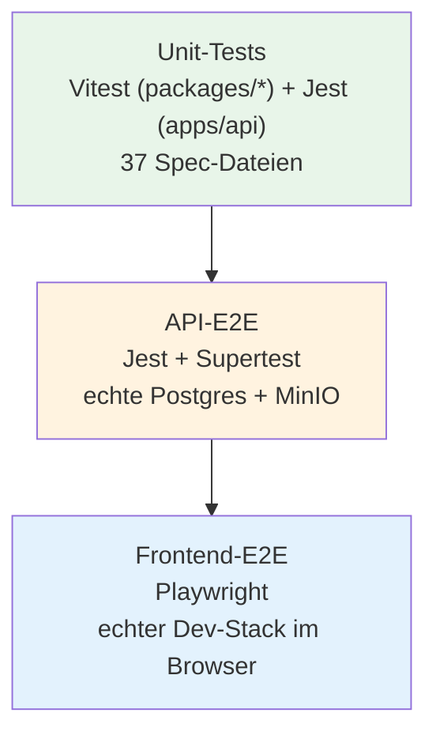

# Testing — Project ORBIT

Beschreibt die Test-Pyramide, wie jede Ebene tatsächlich läuft, was sie
abdeckt und was bewusst nicht. Für den Implementierungsstand jeder
fachlichen Komponente siehe
[`docs/IMPLEMENTATION_STATUS.md`](IMPLEMENTATION_STATUS.md); für die
Live-Funde, die beim Aufbau der Testsuiten selbst gemacht wurden, siehe
`docs/ASSUMPTIONS.md` Phase 14 (#78-84).

## Überblick



Alle drei Ebenen laufen bewusst gegen **echte** Abhängigkeiten, wo
möglich (echtes Postgres, echtes MinIO), nicht gegen In-Memory-Fakes —
außer den bewusst gemockten Drittanbieter-Connectors (Finance/Mail/
Calendar/CRM/Telephony/OCR/LLM), die per Design austauschbare Interfaces
sind (siehe `docs/AGENT_ARCHITECTURE.md`, `docs/INTEGRATIONS.md`).

## 1. Unit-Tests

**Frameworks**: Vitest für alle `packages/*` (`vitest run
--passWithNoTests`), Jest für `apps/api` (`jest`). `apps/web` selbst hat
aktuell keine eigenen Unit-Tests (`vitest run --passWithNoTests` läuft
dort leer durch, siehe `apps/web/vitest.config.ts`, das `e2e/**` explizit
ausschließt, damit Vitest nicht versehentlich die Playwright-Dateien zu
laden versucht — `docs/ASSUMPTIONS.md` #82).

```bash
pnpm test              # alle Pakete via Turborepo
pnpm --filter @orbit/api test          # nur apps/api
pnpm --filter @orbit/api test:cov      # mit Coverage
pnpm --filter @orbit/agent-core test   # nur ein Package
```

**Umfang** (Stand nach Phase 19c): 17 Spec-Dateien in `apps/api/src`
(72 Tests), 20 weitere Spec-Dateien über alle `packages/*` — reine
Business-Logik-Tests (Services, Policy-Entscheidungen, Tool-Registry,
Mock-Connectoren, Tenant-Scoping-Query-Rewriting), Prisma selbst wird
über `jest-mock-extended`-artige Scoped-Mocks ersetzt, kein echter
DB-Zugriff auf dieser Ebene.

**Was hier bewusst nicht getestet wird**: alles, was einen echten
HTTP-Request, echte RLS-Policies oder eine echte
Datei-Upload-Roundtrip braucht — das ist Aufgabe der nächsten Ebene.

## 2. API-E2E-Tests

**Framework**: Jest + Supertest, eigene Config
(`apps/api/test/jest-e2e.json`, `testTimeout: 20000` — höher als Jests
Default 5000ms, siehe `docs/ASSUMPTIONS.md` #103 für die Kalibrierung).

```bash
pnpm --filter @orbit/api test:e2e
```

**Voraussetzung**: Postgres + MinIO müssen laufen (lokal via
`docker compose -f docker-compose.dev.yml up -d`) und `DATABASE_URL`/
`DATABASE_URL_APP`/`S3_*`-Variablen gesetzt sein (aus `.env`, siehe
`docs/LOCAL_DEVELOPMENT.md`). Kein `app.listen()` — `app.init()` reicht,
Supertest spricht direkt mit dem In-Memory-HTTP-Server, kein echter
Netzwerk-Listener nötig.

**Fünf Suiten** (`apps/api/test/*.e2e-spec.ts`, 18 Tests total):

| Suite | Deckt ab |
|---|---|
| `app.e2e-spec.ts` | Health-Checks |
| `auth.e2e-spec.ts` | Login/Refresh/Logout, Rate-Limiting, 401/403-Fälle |
| `finance-workflow.e2e-spec.ts` | Supplier-Freigabe → Dokument-Upload (echtes MinIO) → Invoice → Buchungsvorschlag → Freigabe → Transfer (inkl. 403 ohne freigegebenen Lieferanten) |
| `sales-workflow.e2e-spec.ts` | Company → Contact → Lead+Task → Terminvorschlag → Terminbestätigung |
| `intake-workflow.e2e-spec.ts` | Agent-Intake-Endpunkt (§12-17 Kette live): Finance-Pfad (Klassifikation → Upload → Extraktion → Buchungsvorschlag), Sales-Pfad (Klassifikation → Company → Contact → Lead), OTHER-Pfad (keine Case-Anlage) |

**Isolation zwischen Testläufen**: jede Suite nutzt die geseedeten
Demo-Nutzer (Phase 13) nur zur Authentifizierung — alle fachlichen
Entitäten werden pro Lauf mit `randomUUID()`-eindeutigen Namen/Nummern
frisch angelegt, nie geseedete Fixtures selbst verändert
(`docs/ASSUMPTIONS.md` #80). Wiederholte Läufe ohne Reseed häufen daher
zusätzliche Datensätze an (kein Bug, siehe unten "Reseed nach
Testläufen").

## 3. Frontend-E2E-Tests

**Framework**: Playwright (`apps/web/e2e/`, drei Suiten: `auth`,
`finance`, `sales`, 10 Tests total, Stand Phase 14).

```bash
pnpm --filter @orbit/web test:e2e
```

**Voraussetzung**: der volle Stack läuft bereits (Postgres/Redis/MinIO,
API auf Port 3001, geseedete Demo-Daten) — Playwright startet nur bei
Bedarf den Next.js-Server selbst (`webServer`-Option: lokal
`next dev` wiederverwenden, in CI `next start` gegen den bereits
gebauten Output). Deckt sich mit dem etablierten manuellen QA-Workflow
statt die komplette Infra-Orchestrierung ein zweites Mal nachzubauen
(`docs/ASSUMPTIONS.md` #81).

**Locator-Strategie**: Tests, die auf geseedete Fixtures lesend
zugreifen, scopen ihre Locators bewusst auf die jeweilige Zeile (z. B.
per Rechnungsnummer) statt auf exakte Gesamt-Zeilenzahlen oder global
eindeutigen Text — wiederholte Testläufe ohne Reseed häufen eigene
Datensätze an, mehrere „Mögliche Dublette"-Badges können gleichzeitig
auf der Seite stehen. Mutationen (Lieferanten-Freigabe,
Transfer-Fehlerfall, Lead-Anlage) bauen ihre eigenen frischen Fixtures
per direktem API-Aufruf auf, aus demselben Grund
(`docs/ASSUMPTIONS.md` #81).

**Bekannte Lücke**: die neuen Seiten aus Phase 19a/19b (`/cases`,
`/cases/[id]`, `/sales/leads/[id]`, `/sales/opportunities`,
`/sales/opportunities/[id]`, `/activity`) und die Approval-Center-
Aktionen aus Phase 19c haben noch **keine** Playwright-Abdeckung — nur
manuell im Browser gegen echte Daten verifiziert (siehe
`docs/IMPLEMENTATION_STATUS.md`). Auf Windows scheitert `next build`
ohne aktivierten Entwicklermodus an einer Symlink-Einschränkung
(`docs/ASSUMPTIONS.md` #17) — die Playwright-Suite läuft dort direkt
gegen `next dev` statt den production build zu testen; in Docker/CI
(Linux) tritt das Problem nicht auf.

## Reseed nach Testläufen

Sowohl API-E2E als auch Frontend-E2E häufen bei wiederholten Läufen
zusätzliche Datensätze in der geteilten lokalen Dev-Datenbank an
(bewusst so, siehe oben). Um wieder den sauberen, für manuelle
Demo/QA vorgesehenen Zustand herzustellen:

```bash
pnpm prisma:seed
```

**Nicht** `pnpm db:reset` für diesen Zweck verwenden, sofern der
zugrundeliegende Postgres-Container bestehen bleibt — das verliert die
RLS-Rollen-Grants (`docs/ASSUMPTIONS.md` #93, `docs/DEPLOYMENT.md`).

## CI-Pipeline

`.github/workflows/ci.yml` führt in dieser Reihenfolge aus: Services
hochfahren (Postgres/Redis/MinIO) → `orbit_app`-Rolle provisionieren →
Lint → Typecheck → `prisma:deploy` → Unit-Tests (`pnpm test`) → Build →
Seed → Playwright-Browser installieren → API-Server im Hintergrund
starten + Health-Poll → `pnpm test:e2e` (API- und Frontend-E2E) →
Server stoppen. **Nicht live gegen einen echten GitHub-Actions-Runner
verifiziert** (kein Zugriff in der Entwicklungsumgebung dieser Session)
— jede Einzelkomponente aber gegen das lokale Docker-Äquivalent geprüft
(`docs/ASSUMPTIONS.md` #83, #89).

## Was insgesamt nicht abgedeckt ist

- Last-/Performance-Tests (keine vorhanden).
- Chaos-/Resilienz-Tests (z. B. Verhalten bei Postgres-Verbindungsabbruch
  mitten im Request).
- Sicherheits-/Penetrationstests über die reinen Tenant-Isolation- und
  RBAC-Unit-/E2E-Tests hinaus (kein automatisiertes
  Dependency-Vulnerability-Scanning, siehe `docs/SECURITY.md`).
- Visuelle Regressionstests (kein Screenshot-Diffing).
- Vollständiger `pnpm run test:e2e` im gesamten Workspace in einem
  Durchgang auf Windows (durch die Build-Symlink-Einschränkung
  blockiert, siehe oben) — `@orbit/api`-Teil läuft davon unbeeinträchtigt
  durch, `apps/web`s E2E-Suite wird stattdessen direkt via
  `npx playwright test` gegen den laufenden Dev-Server verifiziert.
